# VPC 3-Tier Architecture

Designed and deployed a 3-tier network architecture on AWS using a custom VPC with public and private subnets, Internet Gateway, NAT Gateway, and route tables. Verified internet isolation per tier using ping tests.

---

## Project Structure
```
.
├── README.md
└── Screenshots
    ├── 01_VPC_Resource_Map.png
    ├── 02_App_Server_Private_No_Public_IP.png
    ├── 03_DB_Server_Private_No_Public_IP.png
    ├── 04_App_Server_Ping_Success.png
    └── 05_DB_Server_Ping_Fail.png
```
---

## Architecture Overview

```
Internet → IGW → Web Tier (Public) → NAT GW → App Tier (Private)
                                              DB Tier (Isolated)
```

| Tier | Subnet | CIDR | Internet Access |
|---|---|---|---|
| Web (Bastion) | `web-public-subnet` | `10.0.1.0/24` | ✅ via IGW |
| App | `app-private-subnet` | `10.0.2.0/24` | ✅ outbound via NAT |
| DB | `db-private-subnet` | `10.0.3.0/24` | ❌ none |

---


```mermaid
flowchart TB
    Internet(["🌐 Internet"])

    subgraph VPC["VPC: my-3tier-vpc (10.0.0.0/16) — us-east-1a"]

        subgraph Tier1["TIER 1 — Web (Public Subnet: 10.0.1.0/24)"]
            IGW["IGW: my-igw"]
            NAT["NAT GW: my-nat-gw\n(Elastic IP)"]
            WEB["EC2: Web-Server\ni-0c04078c3998f587c\nPublic: 34.237.136.192\nPrivate: 10.0.1.234"]
        end

        subgraph Tier2["TIER 2 — App (Private Subnet: 10.0.2.0/24)"]
            APP["EC2: App-Server\ni-0410b0b0daf3e536b\nPrivate: 10.0.2.128\nNo Public IP\n✅ ping google.com via NAT"]
        end

        subgraph Tier3["TIER 3 — DB (Private Subnet: 10.0.3.0/24)"]
            DB["EC2: DB-Server\ni-09c6a8dbd55a60bd2\nPrivate: 10.0.3.82\nNo Public IP\n❌ ping google.com (isolated)"]
        end

    end

    Internet -->|"HTTP/SSH"| IGW
    IGW --> WEB
    WEB -->|"SSH Tunnel"| APP
    NAT -->|"Outbound Only"| Internet
    APP -->|"Outbound via NAT"| NAT
    APP -.->|"Internal only"| DB
```

## Resources Created

| Resource | Name | Details |
|---|---|---|
| VPC | `my-3tier-vpc` | CIDR: `10.0.0.0/16`, us-east-1 |
| Internet Gateway | `my-igw` | Attached to VPC |
| NAT Gateway | `my-nat-gw` | In web-public-subnet, Elastic IP |
| Public Route Table | `public-rt` | `0.0.0.0/0` → `my-igw` |
| App Route Table | `app-private-rt` | `0.0.0.0/0` → `my-nat-gw` |
| DB Route Table | `db-private-rt` | Local only, no internet route |

---

## EC2 Instances

| Instance | ID | Private IP | Public IP | Subnet |
|---|---|---|---|---|
| Web-Server | `i-0c04078c3998f587c` | `10.0.1.234` | `34.237.136.192` | web-public-subnet |
| App-Server | `i-0410b0b0daf3e536b` | `10.0.2.128` | None | app-private-subnet |
| DB-Server | `i-09c6a8dbd55a60bd2` | `10.0.3.82` | None | db-private-subnet |

---

## Verification

### App Server — Outbound Internet via NAT ✅
```
ubuntu@ip-10-0-2-128:~$ ping google.com
64 bytes from bj-in-f139.1e100.net: icmp_seq=1 ttl=108 time=2.20 ms
64 bytes from bj-in-f139.1e100.net: icmp_seq=2 ttl=108 time=1.70 ms
5 packets transmitted, 5 received, 0% packet loss
```

### DB Server — No Internet Access ✅
```
ubuntu@ip-10-0-3-82:~$ ping google.com
35 packets transmitted, 0 received, 100% packet loss
```

---

## Screenshots

### 01 — VPC Resource Map
*Shows `my-3tier-vpc` with all 3 subnets, 5 route tables, IGW and NAT Gateway in the resource map.*


### 02 — App Server: No Public IP (Private Subnet)
*Shows `app-server` Connect page warning — no public IP, instance is in `app-private-subnet`.*


### 03 — DB Server: No Public IP (Private Subnet)
*Shows `db-server` Connect page warning — no public IP, instance is in `db-private-subnet`.*


### 04 — App Server: Ping Success via NAT Gateway
*Shows `ping google.com` succeeding from `ip-10-0-2-128` — outbound internet via NAT Gateway confirmed.*


### 05 — DB Server: Ping Fail (Isolated)
*Shows `ping google.com` with 100% packet loss from `ip-10-0-3-82` — DB tier has no internet route.*


---

## Result

- **Web Tier:** Publicly accessible, acts as bastion host
- **App Tier:** Private, outbound internet via NAT Gateway (for updates/packages)
- **DB Tier:** Fully isolated — zero internet access, reachable only from App Tier

