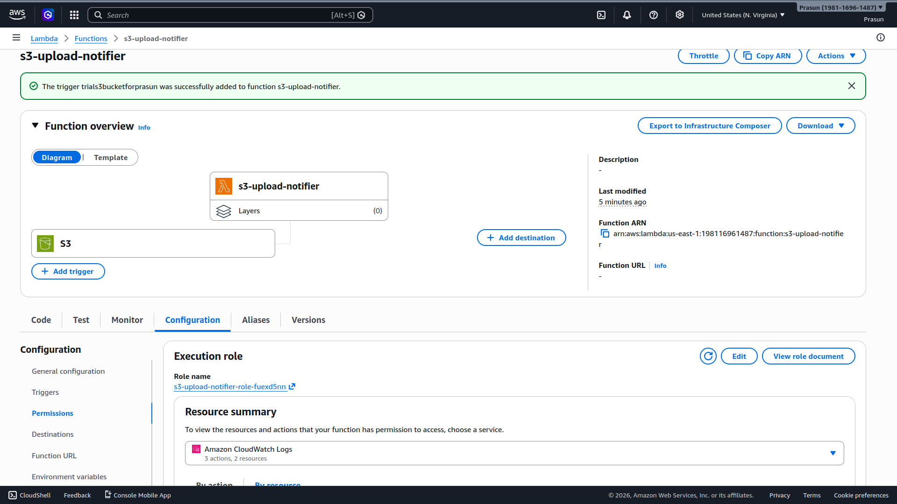
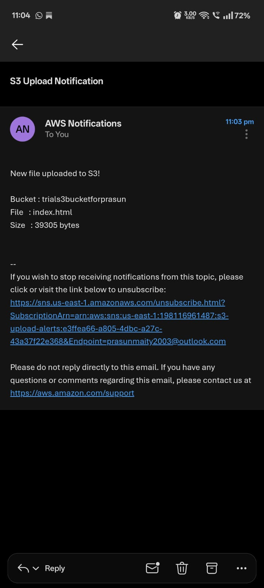

# S3 Upload Email Notification (Lambda + SNS)

## Project Structure
```
.
├── README.md
├── lambda_function.py
└── Screenshots
    ├── 01_SNS_Topic_Confirmed.png
    ├── 02_Lambda_S3_Trigger.png
    └── 03_Email_Notification_Received.png
```

## What Was Done
1. Created SNS topic `s3-upload-alerts`, added email subscription for `prasunmaity2003@outlook.com` (confirmed)
2. Created Lambda `s3-upload-notifier` (Python 3.12) with `AmazonSNSFullAccess` + `AmazonS3ReadOnlyAccess`
3. Lambda reads bucket name, file key, and size from the S3 PUT event and publishes to SNS
4. Added S3 event trigger on `trials3bucketforprasun` (PUT events only) to Lambda
5. Uploaded `index.html` (39,305 bytes) to S3 bucket
6. Lambda triggered automatically → SNS email delivered with bucket, filename, and size ✅
7. Confirmed end-to-end: upload event → Lambda → SNS → email, fully serverless

## Screenshots
### 01 — SNS Topic with Confirmed Subscription
*Shows `s3-upload-alerts` with email subscription in Confirmed status.*


### 02 — Lambda Function with S3 Trigger
*Shows `s3-upload-notifier` with S3 `trials3bucketforprasun` trigger added.*


### 03 — Email Notification Received
*Email from AWS with bucket name, file `index.html`, size 39305 bytes.*

