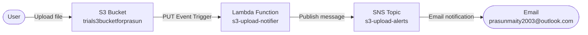

# S3 Upload Email Notification (Lambda + SNS)

Implemented an event-driven notification system where uploading any file to an S3 bucket automatically triggers a Lambda function that sends an email alert via SNS.

---

## Project Structure

```
.
├── README.md
├── lambda_function.py
└── Screenshots
    ├── 01_SNS_Topic_Confirmed.png
    ├── 02_Lambda_S3_Trigger.png
    └── 03_Email_Notification_Received.png
```

---

## Architecture

```
S3 Upload → S3 Event Trigger → Lambda → SNS Topic → Email
```



---

## Resources Created

| Resource | Name | Details |
|---|---|---|
| S3 Bucket | `trials3bucketforprasun` | Trigger source |
| Lambda Function | `s3-upload-notifier` | Python 3.12, us-east-1 |
| SNS Topic | `s3-upload-alerts` | Standard, ARN: `arn:aws:sns:us-east-1:198116961487:s3-upload-alerts` |
| SNS Subscription | Email | `prasunmaity2003@outlook.com` — Confirmed |

---

## Lambda Function

```python
import boto3

def lambda_handler(event, context):
    sns = boto3.client('sns')

    bucket = event['Records']['s3']['bucket']['name']
    key    = event['Records']['s3']['object']['key']
    size   = event['Records']['s3']['object']['size']

    message = f"""New file uploaded to S3!

Bucket : {bucket}
File   : {key}
Size   : {size} bytes
"""

    sns.publish(
        TopicArn='arn:aws:sns:us-east-1:198116961487:s3-upload-alerts',
        Subject='S3 Upload Notification',
        Message=message
    )

    return {'statusCode': 200, 'body': 'Notification sent!'}
```

---

## IAM Permissions on Lambda Role

| Policy | Purpose |
|---|---|
| `AmazonSNSFullAccess` | Allows Lambda to publish to SNS topic |
| `AmazonS3ReadOnlyAccess` | Allows Lambda to read S3 event metadata |
| `CloudWatchLogsFullAccess` | Auto-attached for Lambda logging |

---

## Verification

### Email Received ✅
```
Subject : S3 Upload Notification
From    : AWS Notifications

New file uploaded to S3!

Bucket : trials3bucketforprasun
File   : index.html
Size   : 39305 bytes
```

---

## Screenshots

### 01 — SNS Topic with Confirmed Subscription
*Shows `s3-upload-alerts` SNS topic with `prasunmaity2003@outlook.com` subscription in **Confirmed** status.*


### 02 — Lambda Function with S3 Trigger
*Shows `s3-upload-notifier` Lambda function with S3 (`trials3bucketforprasun`) trigger successfully added.*


### 03 — Email Notification Received
*Shows actual email received from AWS Notifications with bucket name `trials3bucketforprasun`, file `index.html`, and size `39305 bytes`.*


---

## Result

Every file uploaded to `trials3bucketforprasun` instantly triggers the Lambda function which publishes a message to the SNS topic — delivering a real-time email notification with bucket name, file name, and file size. No polling, no cron — pure **event-driven architecture**.

