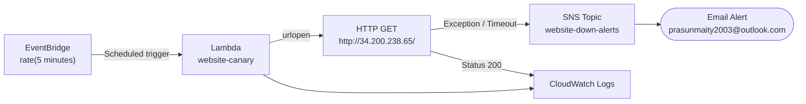

# Website Down Alert using Lambda Canary + SNS

Built an automated website uptime monitoring system using a Lambda canary function scheduled via EventBridge. When the monitored website is unreachable, an instant email alert is sent via SNS.

---

## Project Structure

```
.
├── README.md
├── lambda_function.py
└── Screenshots
    ├── 01_Lambda_EventBridge_Trigger.png
    ├── 02_Lambda_Test_UP.png
    ├── 03_Lambda_Test_DOWN.png
    ├── 04_CloudWatch_Logs.png
    └── 05_Email_Alert_Received.png
```

---

## Architecture

```
EventBridge (rate 5 min) → Lambda Canary → HTTP Check
                                         ├── UP  → Log "Website UP"
                                         └── DOWN → SNS → Email Alert
```



---

## Resources

| Resource | Name | Details |
|---|---|---|
| Lambda Function | `website-canary` | Python 3.12, us-east-1 |
| EventBridge Rule | `every-5-minutes` | `rate(5 minutes)` |
| SNS Topic | `website-down-alerts` | Standard type |
| SNS Subscription | Email | `prasunmaity2003@outlook.com` — Confirmed |
| Monitored Server | EC2 Nginx | `http://34.200.238.65/` |

---

## Lambda Function

```python
import urllib.request
import boto3

WEBSITE_URL = "http://34.200.238.65/"
SNS_TOPIC_ARN = "arn:aws:sns:us-east-1:198116961487:website-down-alerts"

def lambda_handler(event, context):
    sns = boto3.client('sns')

    try:
        response = urllib.request.urlopen(WEBSITE_URL, timeout=10)
        status = response.getcode()

        if status == 200:
            print(f"Website UP: {WEBSITE_URL} - Status {status}")
            return {'statusCode': 200, 'body': 'Website is UP'}
        else:
            raise Exception(f"Unexpected status code: {status}")

    except Exception as e:
        message = f"""ALERT: Website Down!

URL    : {WEBSITE_URL}
Error  : {str(e)}
Action : Please investigate immediately.
"""
        sns.publish(
            TopicArn=SNS_TOPIC_ARN,
            Subject='ALERT: Website Down!',
            Message=message
        )
        print(f"Alert sent! Error: {e}")
        return {'statusCode': 500, 'body': 'Website is DOWN - Alert sent'}
```

---

## Web Server (EC2)

The monitored server runs **Nginx** on Ubuntu EC2:

```bash
sudo apt update && sudo apt install nginx -y
sudo cp website_files/* /var/www/html/
sudo systemctl status nginx
```

---

## Test Results

### Website UP Test
```json
{
  "statusCode": 200,
  "body": "Website is UP"
}
```
Log: `Website UP: http://34.200.238.65/ - Status 200`
Duration: `97.42 ms`

### Website DOWN Simulation
```json
{
  "statusCode": 500,
  "body": "Website is DOWN - Alert sent"
}
```
Log: `Alert sent! Error: <urlopen error [Errno 16] Device or resource busy>`

### Email Alert Received
```
Subject : ALERT: Website Down!
From    : AWS Notifications

ALERT: Website Down!

URL    : https://this-site-does-not-exist-xyz123.com/
Error  : <urlopen error [Errno 16] Device or resource busy>
Action : Please investigate immediately.
```

---

## CloudWatch Logs

Log group: `/aws/lambda/website-canary`

```
2026-02-28T18:22:00  Website UP: http://34.200.238.65/ - Status 200
2026-02-28T18:23:00  Website UP: http://34.200.238.65/ - Status 200
2026-02-28T18:26:57  Website UP: http://34.200.238.65/ - Status 200
```

---

## Screenshots

### 01 — Lambda with EventBridge Trigger
*Shows `website-canary` function with `every-5-minutes` EventBridge trigger successfully added.*


### 02 — Lambda Test: Website UP
*Shows test result `statusCode: 200, body: "Website is UP"` with CloudWatch log confirming Status 200.*


### 03 — Lambda Test: Website DOWN
*Shows test result `statusCode: 500, body: "Website is DOWN - Alert sent"` triggered by bad URL.*


### 04 — CloudWatch Logs
*Shows repeated successful checks `Website UP: http://34.200.238.65/ - Status 200` every 5 minutes.*


### 05 — Email Alert Received
*Shows actual email from AWS Notifications with subject `ALERT: Website Down!` including URL and error details.*


---

## Result

The Lambda canary runs every 5 minutes via EventBridge. When the website responds with HTTP 200, it silently logs success to CloudWatch. When unreachable, it instantly publishes an alert to SNS delivering a real-time email — fully automated, serverless uptime monitoring with zero infrastructure to manage.