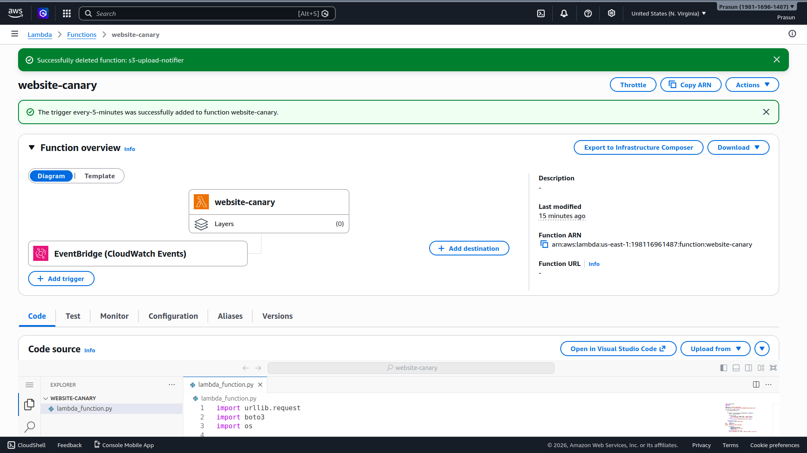
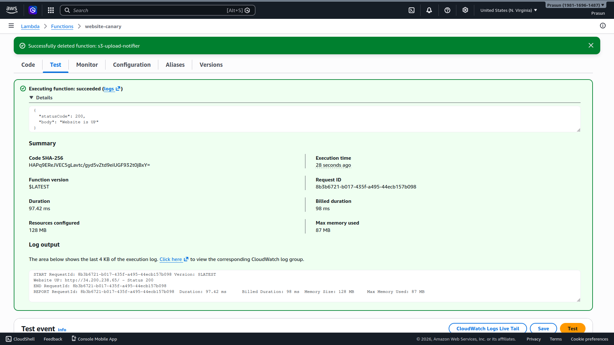
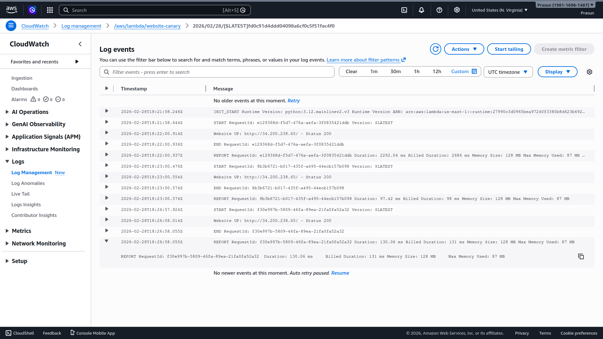
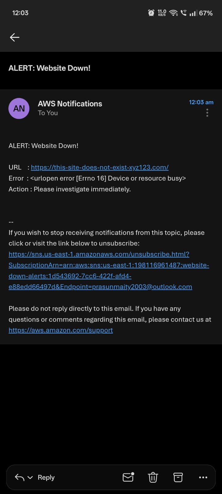

# Website Down Alert using Lambda Canary + SNS

## Project Structure
```
.
├── README.md
├── lambda_function.py
└── Screenshots
    ├── 01_Lambda_EventBridge_Trigger.png
    ├── 02_Lambda_Test_UP.png
    ├── 03_Lambda_Test_DOWN.png
    ├── 04_CloudWatch_Logs.png
    └── 05_Email_Alert_Received.png
```

## What Was Done
1. Created SNS topic `website-down-alerts`, subscribed email `prasunmaity2003@outlook.com` (confirmed)
2. Created Lambda function `website-canary` (Python 3.12) — HTTP GETs monitored URL, publishes to SNS on failure
3. Created EventBridge rule `every-5-minutes` (`rate(5 minutes)`) to trigger Lambda automatically
4. Attached `AmazonSNSFullAccess` + CloudWatch Logs to Lambda execution role
5. Tested UP scenario → `statusCode: 200, body: "Website is UP"`, logged to CloudWatch ✅
6. Tested DOWN simulation (bad URL) → `statusCode: 500, body: "Website is DOWN - Alert sent"` ✅
7. Email alert received: subject `ALERT: Website Down!` with URL and error details ✅

## Screenshots
### 01 — Lambda with EventBridge Trigger
*Shows `website-canary` with `every-5-minutes` EventBridge trigger.*


### 02 — Lambda Test: Website UP
*Shows `statusCode: 200, body: "Website is UP"` with CloudWatch log.*


### 03 — Lambda Test: Website DOWN
*Shows `statusCode: 500, body: "Website is DOWN - Alert sent"`.*


### 04 — CloudWatch Logs
*Repeated `Website UP` checks every 5 minutes.*


### 05 — Email Alert Received
*AWS email with subject `ALERT: Website Down!` including URL and error.*

