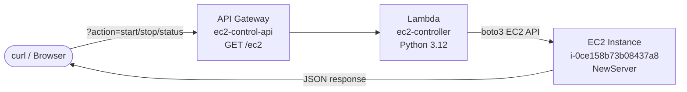
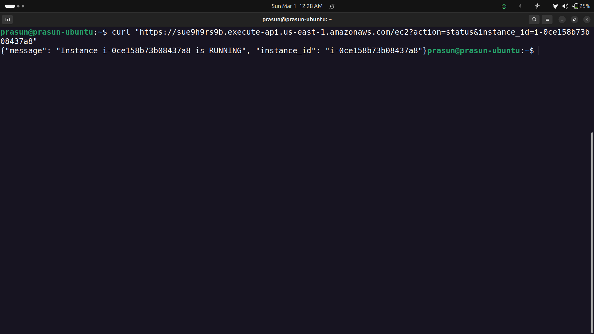

# Start/Stop EC2 using Lambda + API Gateway

Automated EC2 instance control (start, stop, status) using a serverless Lambda function exposed via HTTP API Gateway. Any HTTP client can trigger EC2 actions without AWS Console access.

---

## Project Structure

```
.
├── README.md
├── lambda_function.py
└── Screenshots
    ├── 01_Lambda_ec2_controller.png
    ├── 02_API_Gateway_Route.png
    ├── 03_API_Gateway_Stage.png
    ├── 04_EC2_Running.png
    ├── 05_curl_status.png
    ├── 06_curl_stop.png
    ├── 07_EC2_Stopping.png
    ├── 08_curl_start.png
    └── 09_EC2_Running_Again.png
```

---

## Architecture

```
curl / browser → API Gateway (GET /ec2) → Lambda → EC2 Action → JSON Response
```



---

## Resources

| Resource | Name | Details |
|---|---|---|
| Lambda | `ec2-controller` | Python 3.12, us-east-1 |
| API Gateway | `ec2-control-api` | HTTP API, Stage: `$default` |
| Route | `GET /ec2` | Query params: `action`, `instance_id` |
| EC2 Instance | `NewServer` | `i-0ce158b73b08437a8`, t3.micro |
| IAM Policy | `AmazonEC2FullAccess` | Attached to Lambda execution role |

**Invoke URL:** `https://sue9h9rs9b.execute-api.us-east-1.amazonaws.com`

---

## Lambda Function

```python
import boto3
import json

ec2 = boto3.client('ec2', region_name='us-east-1')

def lambda_handler(event, context):
    params = event.get('queryStringParameters') or {}
    action = params.get('action', '').lower()
    instance_id = params.get('instance_id', '')

    if not action or not instance_id:
        return {
            'statusCode': 400,
            'body': json.dumps({'error': 'Missing action or instance_id parameter'})
        }

    try:
        if action == 'start':
            ec2.start_instances(InstanceIds=[instance_id])
            message = f"Instance {instance_id} is STARTING"
        elif action == 'stop':
            ec2.stop_instances(InstanceIds=[instance_id])
            message = f"Instance {instance_id} is STOPPING"
        elif action == 'status':
            response = ec2.describe_instances(InstanceIds=[instance_id])
            state = response['Reservations']['Instances']['State']['Name']
            message = f"Instance {instance_id} is {state.upper()}"
        else:
            return {
                'statusCode': 400,
                'body': json.dumps({'error': 'Invalid action. Use start, stop, or status'})
            }

        return {
            'statusCode': 200,
            'body': json.dumps({'message': message, 'instance_id': instance_id})
        }

    except Exception as e:
        return {
            'statusCode': 500,
            'body': json.dumps({'error': str(e)})
        }
```

---

## API Usage

```bash
BASE="https://sue9h9rs9b.execute-api.us-east-1.amazonaws.com/ec2"
ID="i-0ce158b73b08437a8"

# Check status
curl "$BASE?action=status&instance_id=$ID"

# Stop instance
curl "$BASE?action=stop&instance_id=$ID"

# Start instance
curl "$BASE?action=start&instance_id=$ID"
```

---

## API Responses

```json
// status
{"message": "Instance i-0ce158b73b08437a8 is RUNNING", "instance_id": "i-0ce158b73b08437a8"}

// stop
{"message": "Instance i-0ce158b73b08437a8 is STOPPING", "instance_id": "i-0ce158b73b08437a8"}

// start
{"message": "Instance i-0ce158b73b08437a8 is STARTING", "instance_id": "i-0ce158b73b08437a8"}
```

---

## Screenshots

### 01 — Lambda Function
*Shows `ec2-controller` Lambda with code deployed, Python 3.12 runtime.*


### 02 — API Gateway Route
*Shows `GET /ec2` route on `ec2-control-api` with Lambda integration.*


### 03 — API Gateway Stage
*Shows `$default` stage with Invoke URL and Automatic Deployment enabled.*


### 04 — curl: Status (RUNNING)
*Shows curl returning `Instance is RUNNING` before stop.*


### 05 — curl: Stop + Status (STOPPING)
*Shows curl stop returning `STOPPING`, followed by status confirming `STOPPING`.*


### 06 — curl: Start + Status (PENDING)
*Shows curl start returning `STARTING`, followed by status confirming `PENDING`.*


---

## Result

A single GET request to the API endpoint controls EC2 state — no AWS Console needed. Lambda handles the boto3 EC2 API calls, API Gateway exposes it as a public HTTP endpoint, demonstrating **serverless automation** with zero idle infrastructure cost.