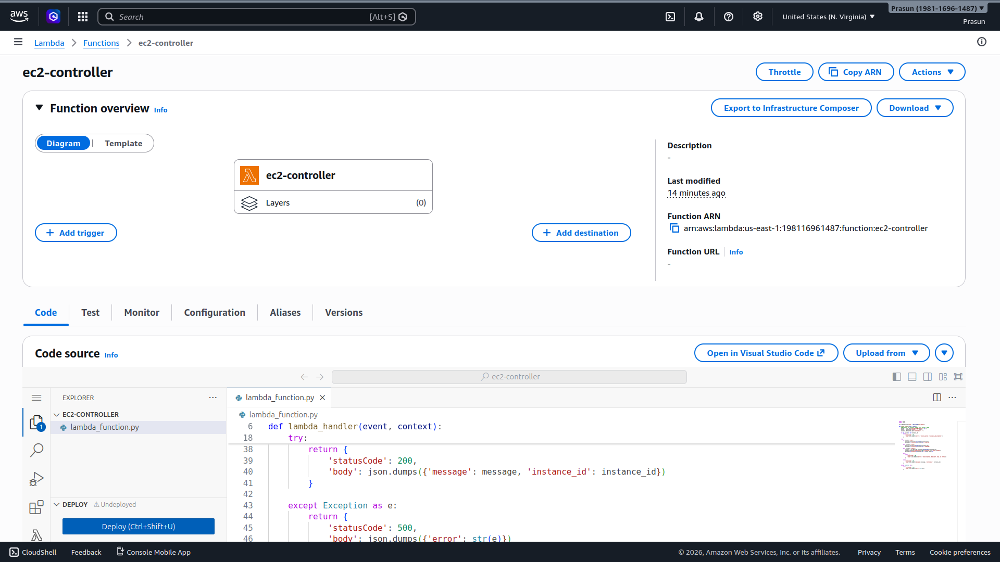
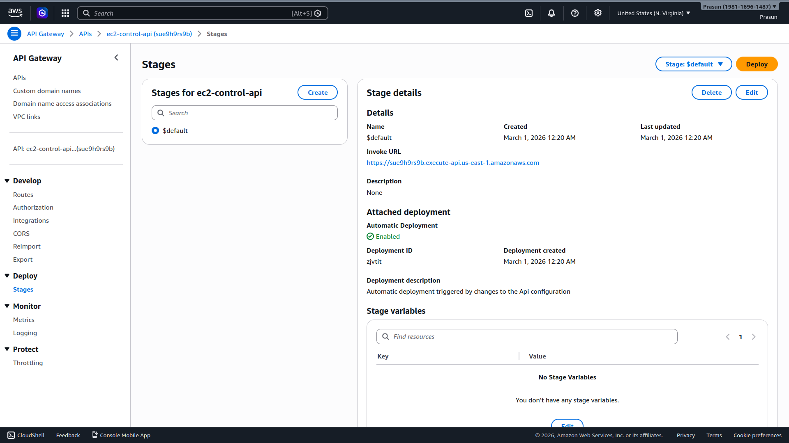
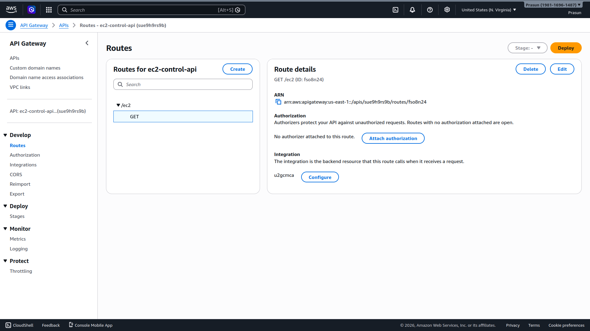
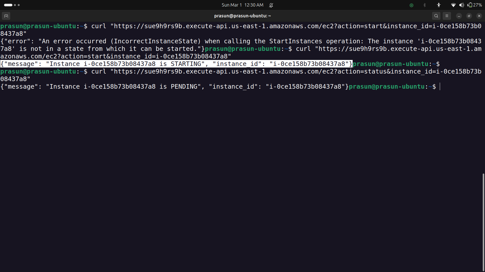

# Start/Stop EC2 using Lambda + API Gateway

## Project Structure
```
.
├── README.md
├── lambda_function.py
└── Screenshots
    ├── 01_Lambda_ec2_controller.png
    ├── 02_API_Gateway_Route.png
    ├── 03_API_Gateway_Stage.png
    ├── 05_curl_status.png
    ├── 06_curl_stop.png
    └── 08_curl_start.png
```

## What Was Done
1. Created Lambda function `ec2-controller` (Python 3.12) with `AmazonEC2FullAccess` policy
2. Lambda accepts `action` (start/stop/status) and `instance_id` as URL query parameters
3. Created HTTP API Gateway `ec2-control-api` with route `GET /ec2`, stage `$default`
4. Integrated route with Lambda; deployed with Automatic Deployment enabled
5. Tested `?action=status` → returned `Instance is RUNNING` ✅
6. Tested `?action=stop` → EC2 entered `STOPPING` state ✅
7. Tested `?action=start` → EC2 entered `STARTING` state ✅

## Screenshots
### 01 — Lambda Function
*Shows `ec2-controller` with code deployed, Python 3.12 runtime.*


### 02 — API Gateway Route
*Shows `GET /ec2` route with Lambda integration.*


### 03 — API Gateway Stage
*Shows `$default` stage with Invoke URL.*


### 04 — curl: Stop + Start
*Shows curl stop returning `STOPPING`, curl start returning `STARTING`.*


