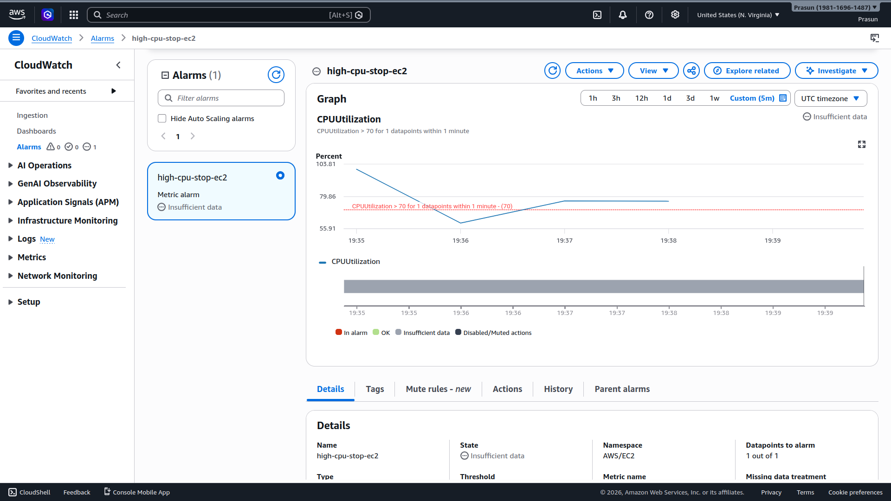
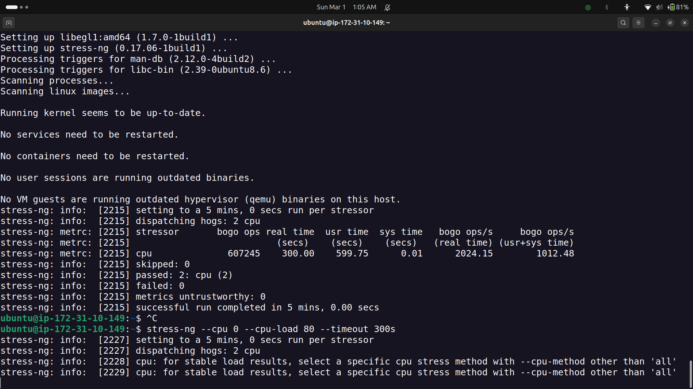
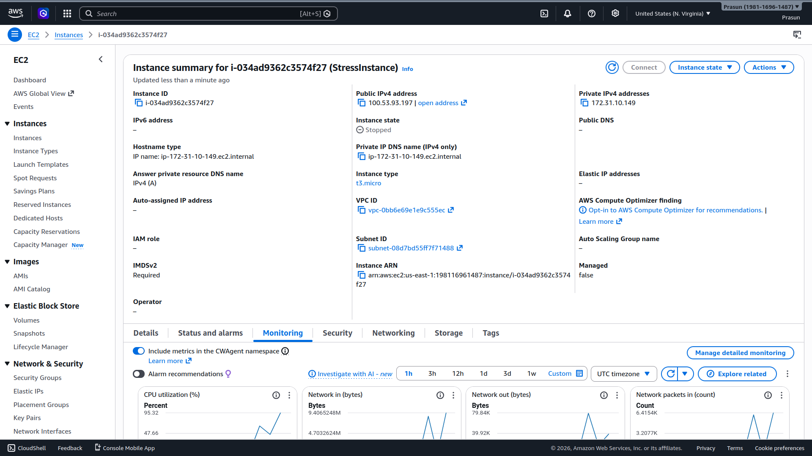
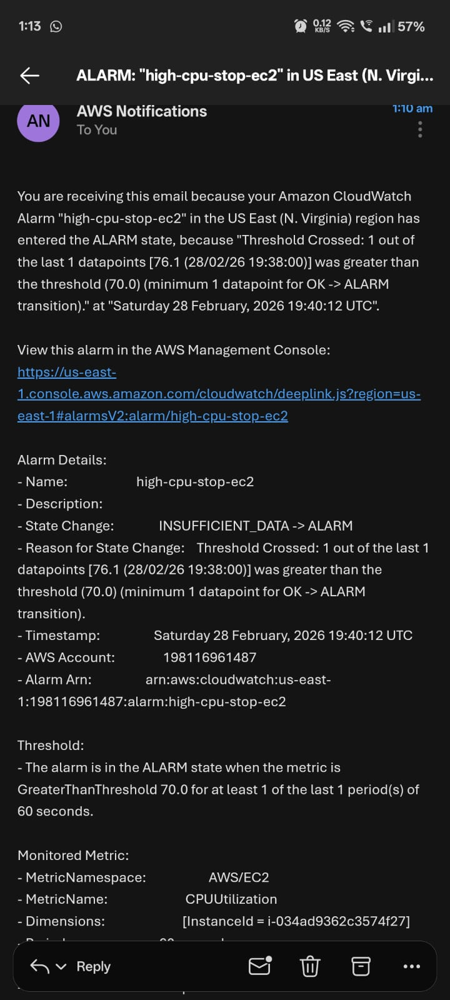

# CloudWatch Alarm — 70% CPU Auto Stop + Email Alert

Configured a CloudWatch metric alarm on an EC2 instance to automatically stop the instance and send an SNS email alert when CPU utilization exceeds 70%.

---

## Project Structure

```
.
├── README.md
└── Screenshots
    ├── 01_CloudWatch_Alarm_Created.png
    ├── 02_stress_ng_running.png
    ├── 03_CPU_Graph_Spike.png
    ├── 04_EC2_Auto_Stopped.png
    └── 05_Email_Alert_Received.png
```

---

## Architecture

```
EC2 (stress-ng) → CPU > 70% → CloudWatch Alarm → SNS Email Alert
                                               → EC2 Auto Stop Action
```

---

## Resources

| Resource | Name | Details |
|---|---|---|
| EC2 Instance | `StressInstance` | `i-034ad9362c3574f27`, t3.micro |
| CloudWatch Alarm | `high-cpu-stop-ec2` | CPUUtilization > 70%, 1 min period |
| Alarm Action | EC2 Stop | Auto stops instance on ALARM |
| SNS Notification | `website-down-alerts` | Email: `prasunmaity2003@outlook.com` |

---

## Alarm Configuration

| Setting | Value |
|---|---|
| Metric | `CPUUtilization` |
| Namespace | `AWS/EC2` |
| Statistic | Average |
| Period | 60 seconds |
| Threshold | Greater than **70%** |
| Datapoints to alarm | 1 out of 1 |
| On ALARM action | Stop EC2 instance + SNS email |

---

## CPU Stress Test

```bash
# Install stress-ng
sudo apt install stress-ng -y

# Spike CPU using all cores for 5 minutes
stress-ng --cpu 0 --timeout 300s --metrics-brief

# OR target a specific load %
stress-ng --cpu 0 --cpu-load 80 --timeout 300s
```

**stress-ng result:**
```
stressor    bogo ops   real time   usr time   bogo ops/s
cpu         607245     300.00      599.75     2024.15
passed: 2 cpu
successful run completed in 5 mins, 0.00 secs
```

---

## Alarm Trigger Event

```
Alarm Name  : high-cpu-stop-ec2
State Change: INSUFFICIENT_DATA -> ALARM
Reason      : Threshold Crossed — 1 out of 1 datapoints [76.1] 
              was greater than threshold (70.0)
Timestamp   : Saturday 28 February, 2026 19:40:12 UTC
Metric      : AWS/EC2 — CPUUtilization
Instance ID : i-034ad9362c3574f27
```

---

## Email Alert Received

```
Subject : ALARM: "high-cpu-stop-ec2" in US East (N. Virginia)

You are receiving this email because your Amazon CloudWatch Alarm
"high-cpu-stop-ec2" has entered the ALARM state.

Threshold Crossed: 1 out of the last 1 datapoints [76.1] was 
greater than the threshold (70.0)
```

---

## Screenshots

### 01 — CloudWatch Alarm (Insufficient Data → Alarm)
*Shows `high-cpu-stop-ec2` alarm with CPU graph crossing the 70% threshold dashed line.*


### 02 — stress-ng Terminal Output
*Shows `stress-ng --cpu 0 --timeout 300s` running on EC2 with 2 CPU workers dispatched.*


### 03 — EC2 Instance Auto Stopped
*Shows `StressInstance` (`i-034ad9362c3574f27`) in **Stopped** state — triggered automatically by the CloudWatch alarm action. CPU utilization visible at 95.32% in monitoring tab.*


### 04 — Email Alert
*Shows AWS Notifications email with subject `ALARM: "high-cpu-stop-ec2"` confirming CPU crossed 76.1% at 19:40:12 UTC.*


---

## Result

When `stress-ng` pushed CPU to ~76%, CloudWatch detected the breach within 1 minute. The alarm fired two simultaneous actions — sending an SNS email alert and issuing an EC2 stop command — with zero manual intervention. This demonstrates **automated self-healing infrastructure** using CloudWatch alarm actions.

