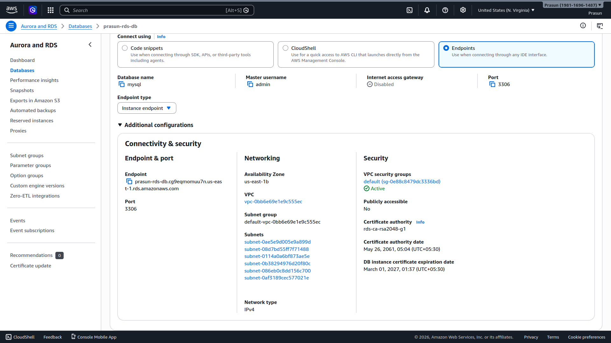
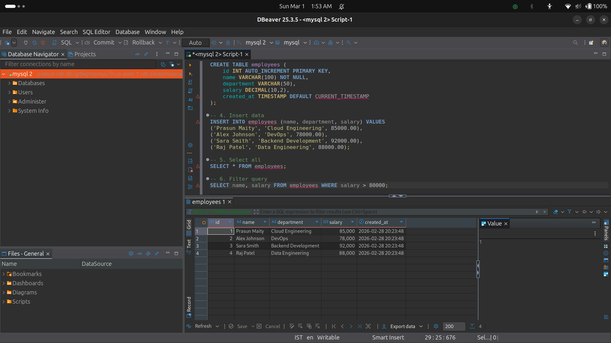
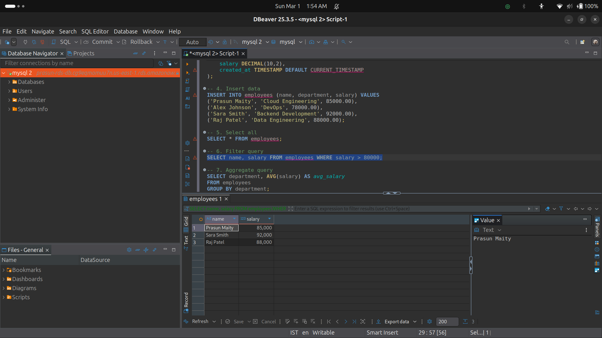
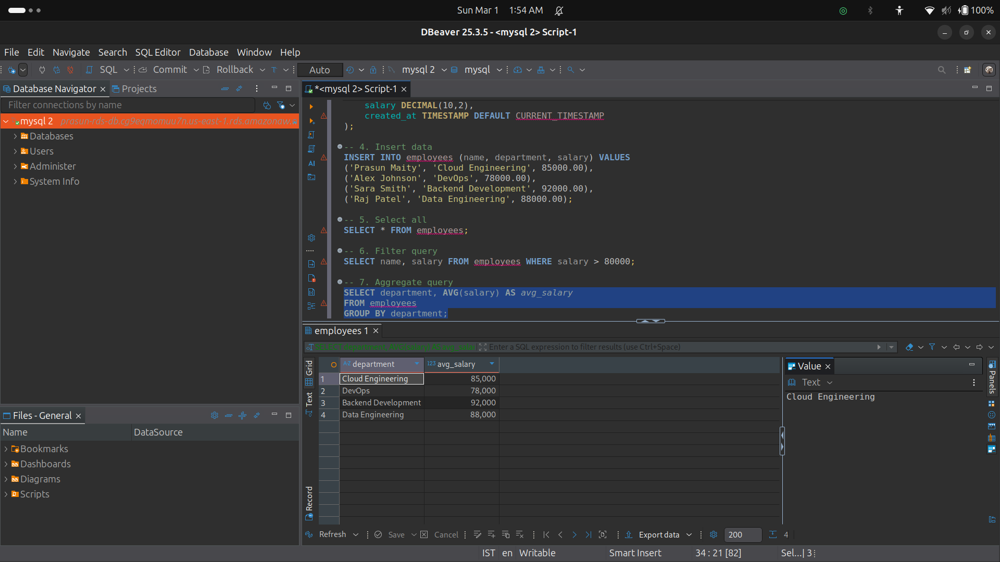

# RDS MySQL Database + DBeaver Connection & SQL Queries

## What Was Done
1. Launched RDS MySQL 8.0 instance (`prasun-rds-db`, db.t3.micro, Free Tier, us-east-1b)
2. Opened Security Group inbound rule for port `3306`
3. Connected DBeaver 25.3.5 with driver props: `allowPublicKeyRetrieval=true`, `useSSL=false`
4. Created database `prasundb` and table `employees` (id, name, department, salary, created_at)
5. Inserted 4 records: Prasun Maity, Alex Johnson, Sara Smith, Raj Patel
6. Ran `SELECT *` — returned all 4 rows ✅
7. Ran `WHERE salary > 80000` filter — returned 3 rows ✅
8. Ran `GROUP BY department` with `AVG(salary)` — returned per-department averages ✅

## Screenshots
### 01 — RDS Connectivity & Security
*Shows `prasun-rds-db` endpoint, port 3306, and security group details.*

### 02 — SELECT * Query Output
*DBeaver showing all 4 employee records.*

### 03 — Filter Query Output
*DBeaver showing 3 employees with salary > 80,000.*

### 04 — Aggregate Query Output
*DBeaver showing AVG salary grouped by department.*

