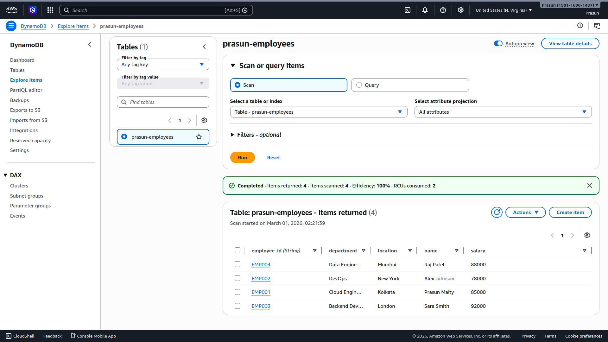
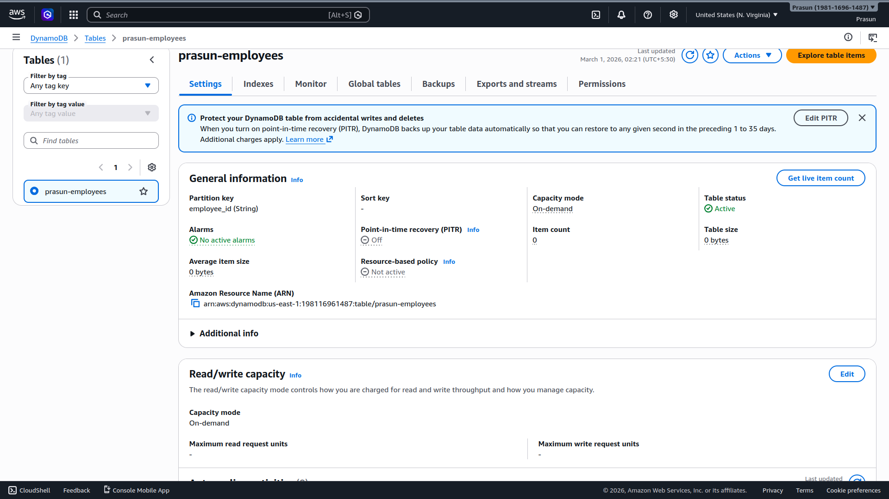

# DynamoDB Table Creation — NoSQL Database on AWS

Created a serverless NoSQL DynamoDB table, inserted 4 employee items as JSON documents, and retrieved all records using a Scan operation via the AWS Console.

---

## Architecture

```
AWS Console → DynamoDB → prasun-employees (Table) → Items (JSON documents)
                                ↓
                    Scan → Returns all items
```

---

## Table Configuration

| Setting | Value |
|---|---|
| Table Name | `prasun-employees` |
| Partition Key | `employee_id` (String) |
| Sort Key | None |
| Capacity Mode | On-demand |
| Table Status | Active |
| Region | us-east-1 |
| Table ARN | `arn:aws:dynamodb:us-east-1:198116961487:table/prasun-employees` |
| PITR | Off |
| Item Count | 4 |

---

## Items Inserted

```json
{
  "employee_id": "EMP001",
  "name": "Prasun Maity",
  "department": "Cloud Engineering",
  "salary": 85000,
  "location": "Kolkata"
}
```
```json
{
  "employee_id": "EMP002",
  "name": "Alex Johnson",
  "department": "DevOps",
  "salary": 78000,
  "location": "New York"
}
```
```json
{
  "employee_id": "EMP003",
  "name": "Sara Smith",
  "department": "Backend Development",
  "salary": 92000,
  "location": "London"
}
```
```json
{
  "employee_id": "EMP004",
  "name": "Raj Patel",
  "department": "Data Engineering",
  "salary": 88000,
  "location": "Mumbai"
}
```

---

## Scan Result

| employee_id | name | department | salary | location |
|---|---|---|---|---|
| EMP001 | Prasun Maity | Cloud Engineering | 85000 | Kolkata |
| EMP002 | Alex Johnson | DevOps | 78000 | New York |
| EMP003 | Sara Smith | Backend Development | 92000 | London |
| EMP004 | Raj Patel | Data Engineering | 88000 | Mumbai |

```
Completed · Items returned: 4 · Items scanned: 4 · Efficiency: 100% · RCUs consumed: 2
```

---

## Screenshots

### 01 — DynamoDB Table Active
*Shows `prasun-employees` table with partition key `employee_id (String)`, capacity mode On-demand, and Table status **Active**.*



### 02 — Scan Result — All Items
*Explore items page showing all 4 employee records returned from a full table Scan with 100% efficiency.*



---

## DynamoDB vs RDS

| Feature | DynamoDB (NoSQL) | RDS MySQL (SQL) |
|---|---|---|
| Schema | Schemaless — flexible attributes | Fixed schema — all rows same columns |
| Scaling | Auto scales (serverless) | Manual scaling |
| Query | Scan / Query by key | Full SQL (JOIN, GROUP BY, etc.) |
| Latency | Single-digit milliseconds | Depends on query complexity |
| Partition Key | Required for every item | Primary key (auto-increment ok) |
| Cost model | Per request (On-demand) | Per hour (instance running) |

---

## Result

A fully serverless DynamoDB table was created with no infrastructure to manage. Four employee items were inserted as schema-flexible JSON documents and successfully retrieved via a Scan operation — demonstrating AWS's managed NoSQL offering where only the partition key is mandatory and each item can carry any additional attributes independently.