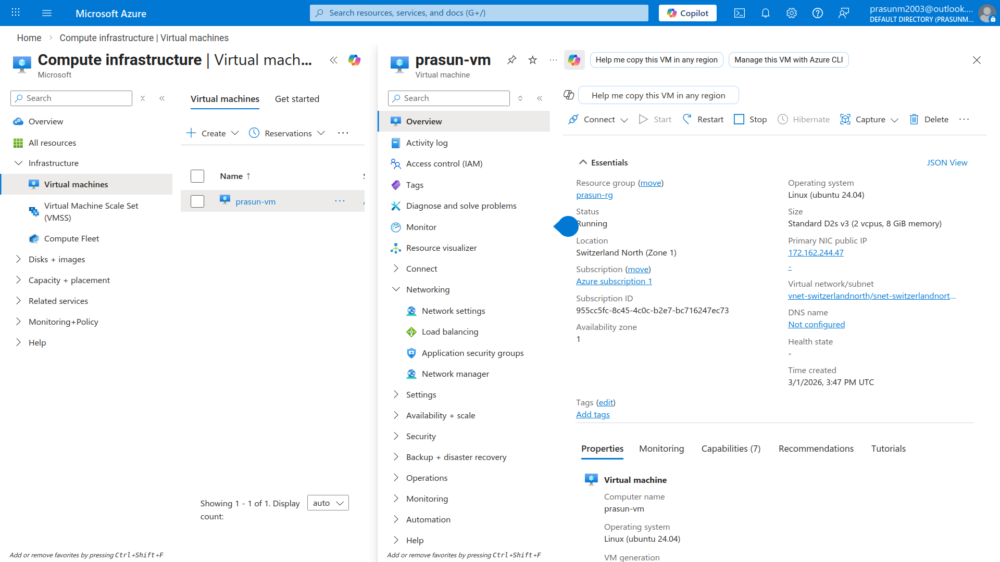
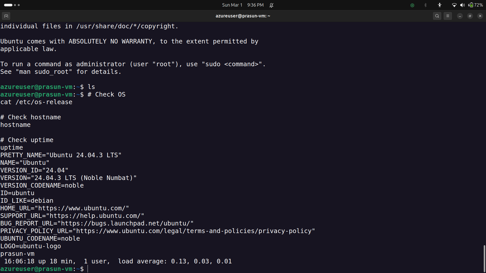

# Azure Virtual Machine — Launch & SSH Access

## Project Structure
```
.
├── README.md
└── Screenshots
    ├── 01_VM_Overview.png
    └── 02_SSH_Terminal.png
```

## What Was Done
1. Created Resource Group `prasun-rg` in **Switzerland North** region
2. Created VM `prasun-vm` — Ubuntu 24.04 LTS, Standard D2s v3 (2 vCPU, 8 GiB), Availability Zone 1
3. Configured SSH key pair `prasun-key` — downloaded `.pem` file for authentication
4. Set NIC Network Security Group to **Basic** with inbound **SSH (port 22)** allowed
5. Created Standard Public IP `prasun-vm-ip` (Zone-redundant, Microsoft network routing) — assigned `172.162.244.47`
6. Connected via SSH: `ssh -i prasun-key.pem azureuser@172.162.244.47` ✅
7. Verified inside VM: OS = `Ubuntu 24.04.3 LTS (Noble Numbat)`, hostname = `prasun-vm`, uptime = 18 min ✅

## Screenshots

### 01 — VM Overview (Azure Portal)
*Shows `prasun-vm` in Running state, Public IP `172.162.244.47`, Location: Switzerland North (Zone 1), OS: Linux (Ubuntu 24.04).*


### 02 — SSH Terminal Access
*Shows successful SSH login as `azureuser@prasun-vm` with Ubuntu 24.04.3 LTS confirmed via `cat /etc/os-release` and uptime output.*


