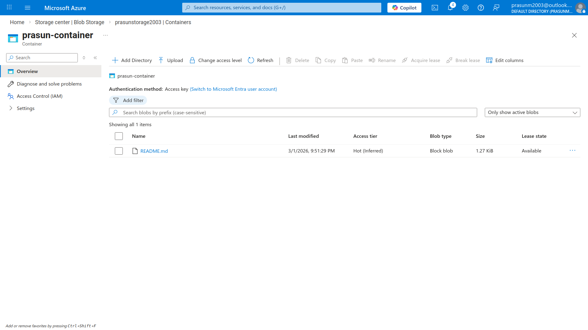
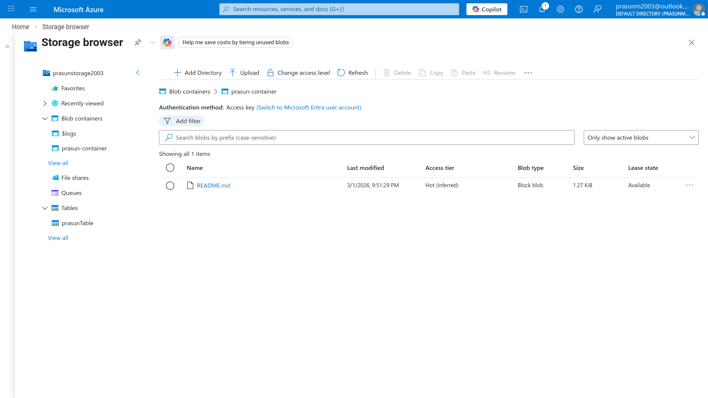
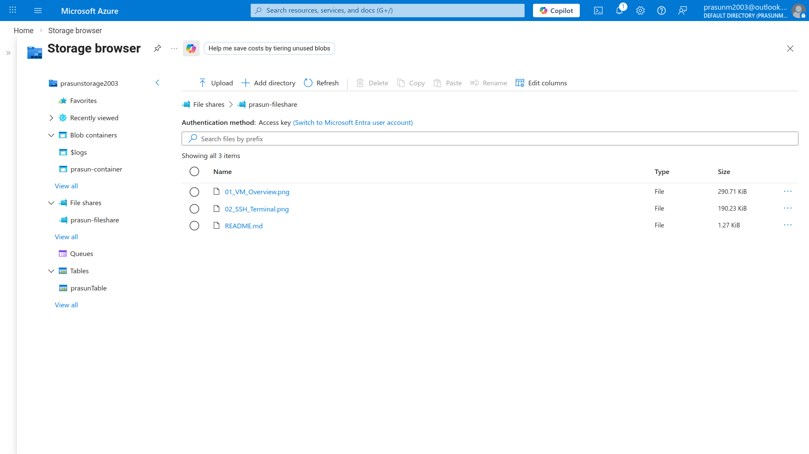
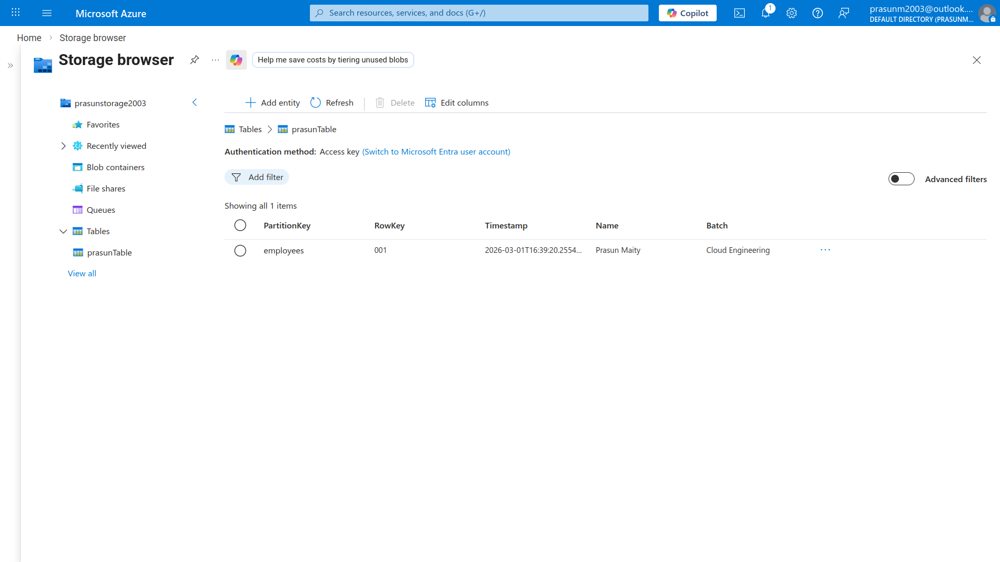

# Azure Storage Account — Blob, File Share, Table

## Project Structure
```
.
├── README.md
└── Screenshots
    ├── 01_Storage_Account_Overview.png
    ├── 02_Blob_Container_Upload.png
    ├── 03_FileShare.png
    └── 04_Table.png
```

## What Was Done
1. Created resource group `prasun-rg` in **Switzerland North** region.
2. Created storage account `prasunstorage2003` (Standard performance, LRS redundancy, Hot access tier, secure transfer enabled, public network access allowed).
3. Left advanced options disabled (hierarchical namespace, SFTP, NFS, cross-tenant replication) and kept Microsoft-managed keys (MMK) for encryption with soft delete enabled for blobs, containers, and file shares (7 days).
4. In the storage account, created a **Blob container** `prasun-container` with private access and uploaded a sample file to explore Azure Blob Storage.
5. Created an **Azure File share** `prasun-fileshare` and uploaded a file through the portal to understand SMB-style file storage in Azure.
6. Created an **Azure Table** named `prasunTable` in the Tables section (via Storage browser), confirming support for NoSQL-style key–value storage within the same account.
7. After collecting screenshots, deleted the entire resource group `prasun-rg`, which removed the storage account and its blob, file share, and table resources to avoid ongoing costs.

## Screenshots

### 01 — Storage Account Overview
*Shows `prasunstorage2003` storage account in Switzerland North with Standard/LRS configuration, Hot access tier, secure transfer enabled, and encryption using Microsoft-managed keys.*


### 02 — Blob Container with Uploaded File
*Displays `prasun-container` blob container inside `prasunstorage2003` and the uploaded sample blob object.*


### 03 — File Share and Table Created
*Shows `prasun-fileshare` under File shares and `prasunTable` listed under Tables within the same storage account, demonstrating multiple Azure storage services from one place.*



