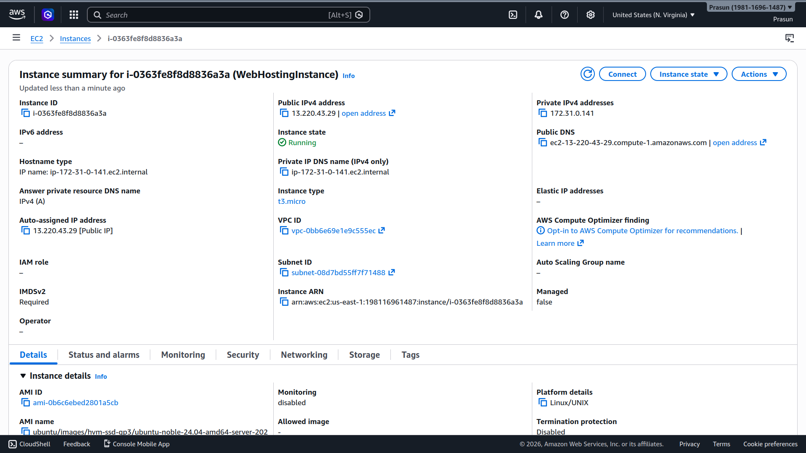
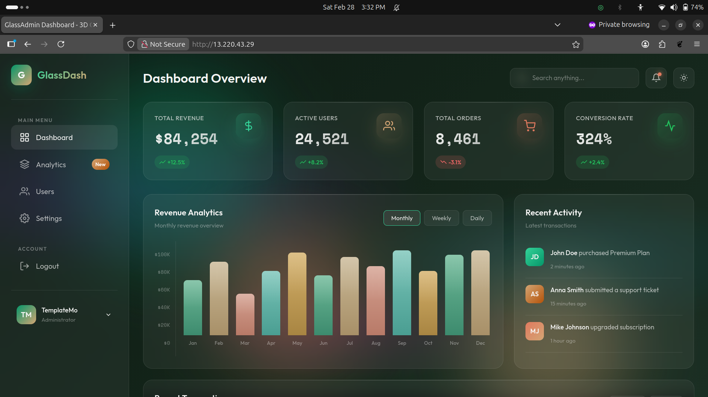

# Static Website Hosting on AWS EC2 with Nginx

## Project Structure
```
.
├── Commands.txt
├── README.md
└── Screenshots
    ├── EC2_setup.png
    └── Hosted_Static_Website.png
```

## What Was Done
1. Launched Ubuntu EC2 t3.micro; Security Group: inbound SSH (22) + HTTP (80) open
2. Ran `sudo apt update && sudo apt install nginx -y` to install Nginx
3. Downloaded GlassAdmin template: `wget -O webpage.zip https://templatemo.com/download/templatemo_607_glass_admin`
4. Extracted and deployed: `unzip webpage.zip && sudo cp -r templatemo_607_glass_admin/. /var/www/html/`
5. Accessed `http://<ec2-public-ip>` in browser — GlassAdmin Dashboard loaded successfully ✅

## Screenshots
### AWS EC2 Instance Setup
*Running Ubuntu t3.micro instance and its networking details.*


### Live Hosted Website
*GlassAdmin Dashboard served via Nginx over HTTP.*

