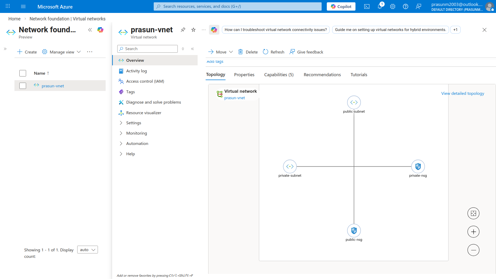
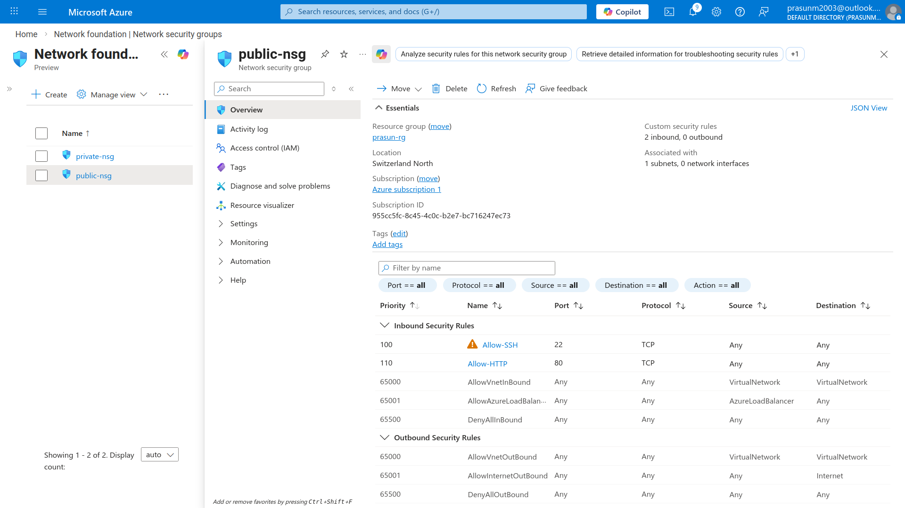

# Azure VNet — Virtual Network & Subnet Configuration

## Project Structure
```
.
├── README.md
└── Screenshots
    ├── 01_VNet_Subnets.png
    └── 02_PublicNSG_Inbound_Rules.png
```

## What Was Done
1. Created resource group `prasun-rg` in **Switzerland North** region
2. Created VNet `prasun-vnet` with address space `10.0.0.0/16` (65,536 addresses)
3. Created `public-subnet` (`10.0.1.0/24`) — intended for internet-facing resources
4. Created `private-subnet` (`10.0.2.0/24`) — intended for internal/backend resources
5. Created NSG `public-nsg` with inbound rules: **Allow SSH (port 22)** at priority 100 and **Allow HTTP (port 80)** at priority 110
6. Created NSG `private-nsg` with inbound rule: **Deny All** (`*`) at priority 100 — blocks all inbound traffic
7. Associated `public-nsg` to `public-subnet` and `private-nsg` to `private-subnet` via VNet → Subnets blade ✅

## Screenshots

### 01 — VNet Subnets View
*Shows `prasun-vnet` Subnets tab with `public-subnet (10.0.1.0/24)` attached to `public-nsg` and `private-subnet (10.0.2.0/24)` attached to `private-nsg`.*


### 02 — Public NSG Inbound Rules
*Shows `public-nsg` inbound security rules: `Allow-SSH` (port 22, priority 100) and `Allow-HTTP` (port 80, priority 110) — both set to Allow.*

