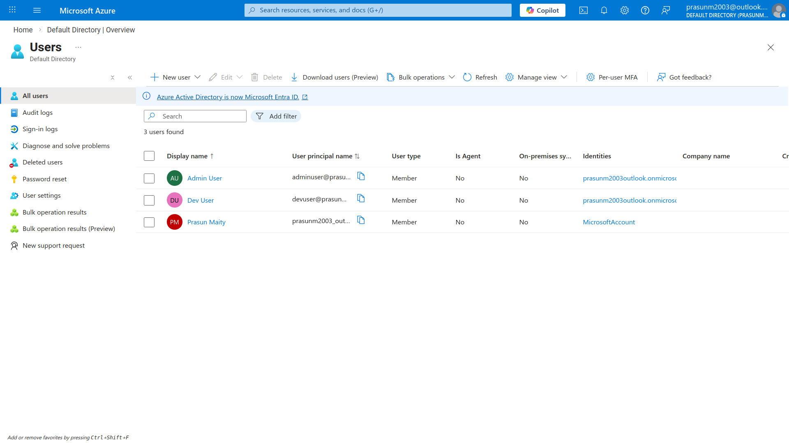
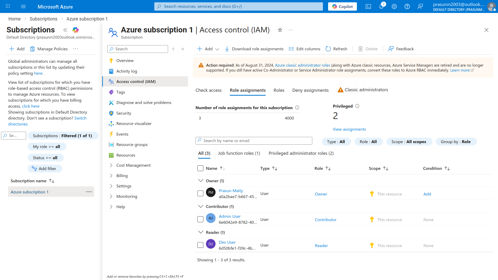

# Azure Entra ID — Users & Role Assignment

## Project Structure
```
.
├── README.md
└── Screenshots
    ├── 01_Entra_Users.png
    └── 02_Role_Assignments.png
```

## What Was Done
1. Opened **Microsoft Entra ID** (formerly Azure Active Directory) from Azure Portal
2. Created user `Dev User` (`devuser@...onmicrosoft.com`) with auto-generated password
3. Created user `Admin User` (`adminuser@...onmicrosoft.com`) with auto-generated password
4. Navigated to **Subscriptions → Azure subscription 1 → Access control (IAM)**
5. Assigned built-in role **Reader** to `Dev User` — grants read-only access to all resources
6. Assigned built-in role **Contributor** to `Admin User` — grants full access to manage resources but not assign roles
7. Verified both role assignments appear in the **Role assignments** tab ✅

## Screenshots

### 01 — Entra ID Users List
*Shows Microsoft Entra ID Users blade with both `Dev User` and `Admin User` successfully created under the default directory.*


### 02 — IAM Role Assignments
*Shows Azure subscription IAM Role assignments tab with `Dev User` assigned Reader role and `Admin User` assigned Contributor role.*

