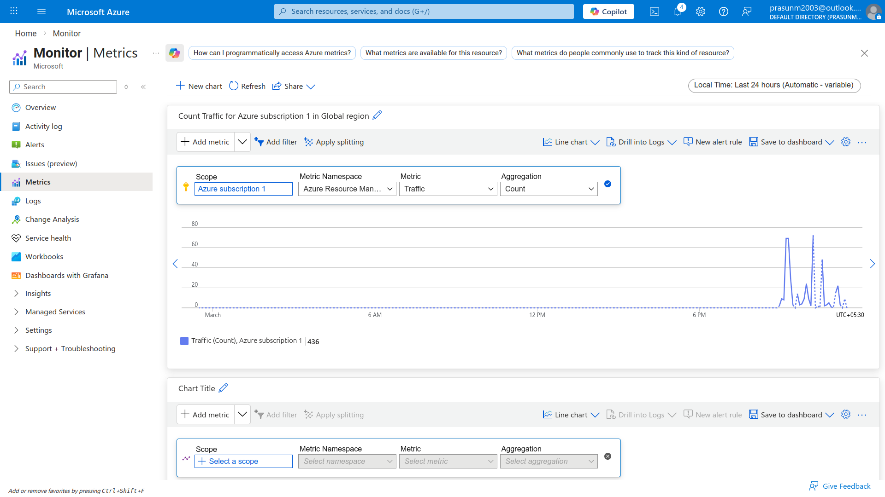
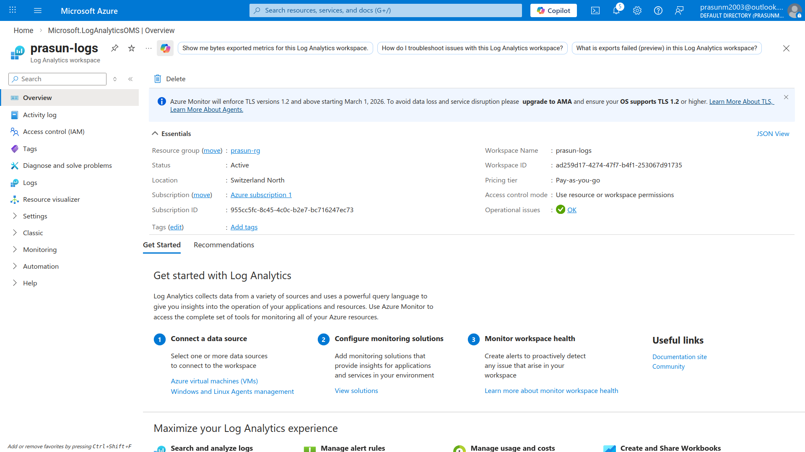

# Azure Monitoring & Diagnostics

## Project Structure
```
.
├── README.md
└── Screenshots
    ├── 01_Metrics_Graph.png
    └── 02_Diagnostic_Settings.png
```

## What Was Done
1. Navigated to **Azure Portal → Monitor → Metrics Explorer**
2. Selected scope: Storage account `prasuntestingmonitor` from `prasun-rg`
3. Set metric to **Transactions** — portal rendered a live traffic count density graph showing request activity over time
4. Navigated to `prasuntestingmonitor` → **Diagnostic settings → + Add diagnostic setting**
5. Named the setting `prasun-diag`, checked **Transaction** under Metrics
6. Created a new **Log Analytics workspace** `prasun-logs` in `Switzerland North` region
7. Set destination to **Send to Log Analytics workspace → prasun-logs**
8. Clicked **Save** — diagnostic setting was successfully created ✅

## Key Concepts Learned

| Concept | Description |
|---|---|
| Azure Monitor | Centralized service to collect, analyze, and act on telemetry from Azure resources |
| Metrics Explorer | Visual tool to plot real-time or historical performance graphs for any resource |
| Diagnostic Settings | Configuration to route resource logs/metrics to a destination like Log Analytics |
| Log Analytics Workspace | Central repository where diagnostic data is stored and queried using KQL |
| Transactions Metric | Tracks the number of requests made to a storage account over time |

## Screenshots

### 01 — Metrics Graph (Traffic Count Density)
*Shows Azure Monitor Metrics Explorer with Transactions metric plotted as a graph for storage account `prasuntestingmonitor`, displaying traffic count density over time.*


### 02 — Diagnostic Settings (prasun-logs)
*Shows the diagnostic setting `prasun-diag` saved on storage account `prasuntestingmonitor` with Transaction metrics being sent to Log Analytics workspace `prasun-logs`.*


## Cleanup
- Deleted Log Analytics workspace `prasun-logs` after screenshots
- Removed diagnostic setting `prasun-diag` from storage account
- Deleted storage account `prasuntestingmonitor` and resource group `prasun-rg`
