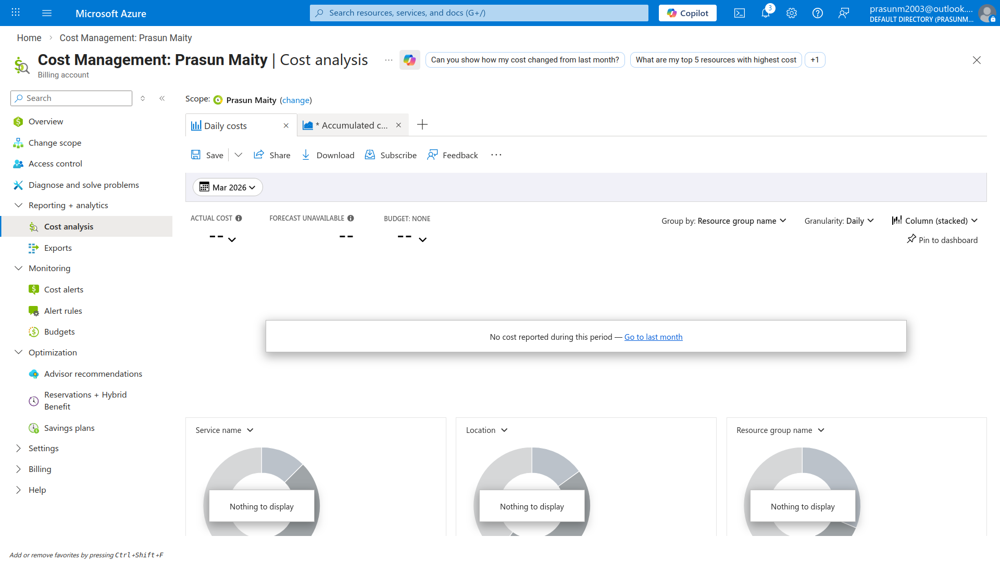
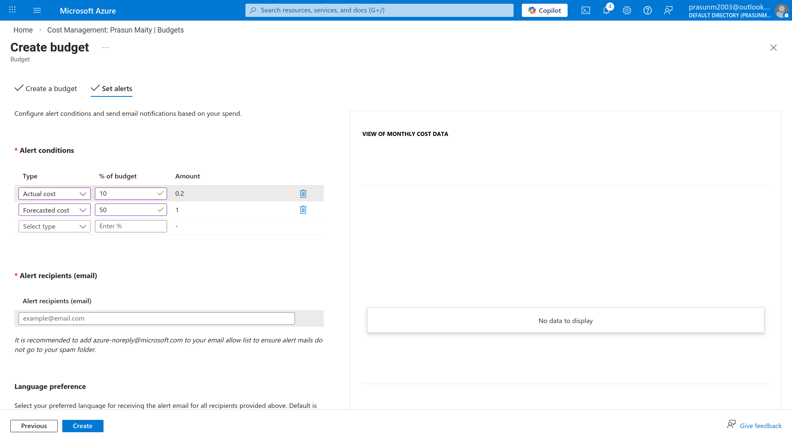
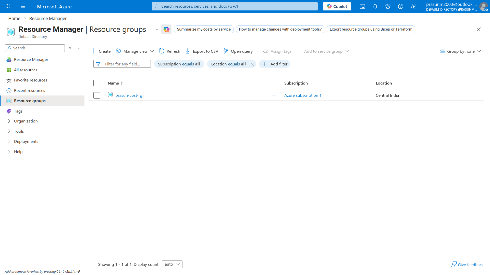

# Azure Resource Manager & Cost Management

## Project Structure
```
.
├── README.md
└── Screenshots
    ├── 01_Cost_Analysis_Dashboard.png
    ├── 02_Budget_Alert_Configuration.png
    └── 03_Resource_Groups_Overview.png
```

## What Was Done
1. Navigated to **Azure Portal → Resource Groups → + Create**
2. Created resource group `prasun-cost-rg` in `Central India` region under `Azure subscription 1`
3. Navigated to **Cost Management → Cost Analysis**
4. Viewed the spending dashboard showing actual costs, forecasted costs, and budget status for the subscription
5. Navigated to **Cost Management → Budgets → + Add**
6. Created budget `prasun-budget` with a monthly reset period and a demo spending limit
7. Configured alert thresholds at specific percentage levels with email notification recipients
8. Verified all configurations are live and visible in the portal ✅

## Key Concepts Learned

| Concept | Description |
|---|---|
| Azure Resource Manager (ARM) | Deployment and management layer for all Azure resources — handles create, update, delete operations |
| Resource Group | Logical container that holds related Azure resources for a solution; used for organization and lifecycle management |
| Cost Management | Azure service to monitor, allocate, and optimize cloud spending across subscriptions |
| Cost Analysis | Visual dashboard showing actual vs forecasted spending over a selected time range |
| Budget | A spending limit with configurable alert thresholds that notifies recipients when costs approach the limit |
| Alert Threshold | A percentage of the budget (e.g. 80%) at which an email notification is automatically triggered |

## Screenshots

### 01 — Cost Analysis Dashboard
*Shows Azure Cost Management dashboard for Prasun Maity's subscription with actual costs, forecasted costs, and current budget status displayed as a visual graph.*


### 02 — Budget Alert Configuration
*Shows the "Set alerts" step of the budget creation wizard with percentage-based alert thresholds and recipient email addresses configured for `prasun-budget`.*


### 03 — Resource Groups Overview
*Shows the Azure Resource Groups list page with `prasun-cost-rg` successfully created in the Central India region under Azure subscription 1.*


## Cleanup
- Deleted budget `prasun-budget` from Cost Management → Budgets
- Deleted resource group `prasun-cost-rg` (no resources inside, safe to remove)

> Note: Cost Management and resource groups themselves incur no charges.

