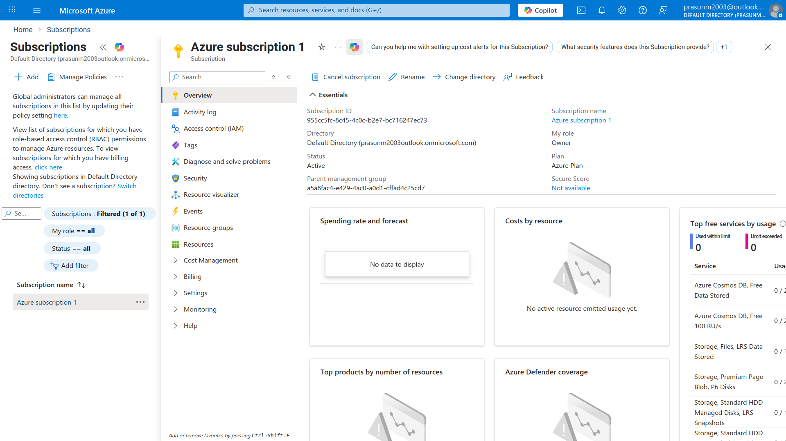
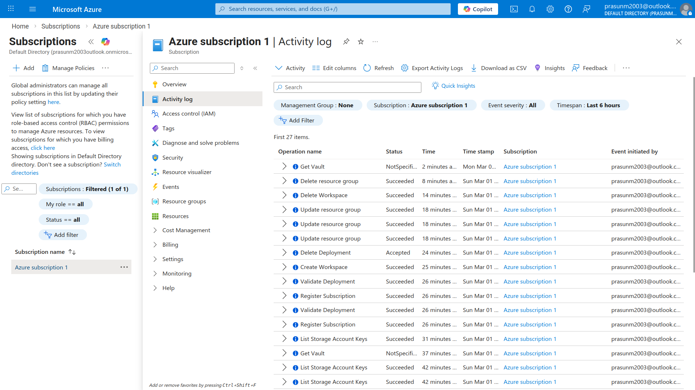
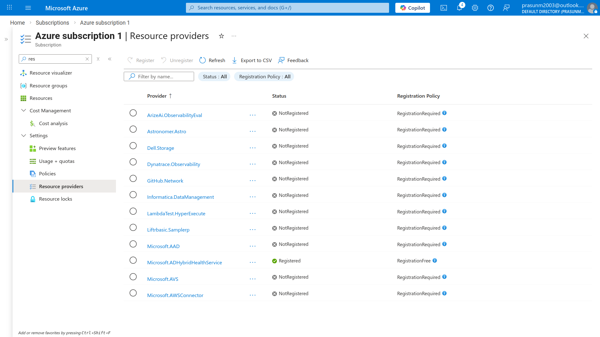
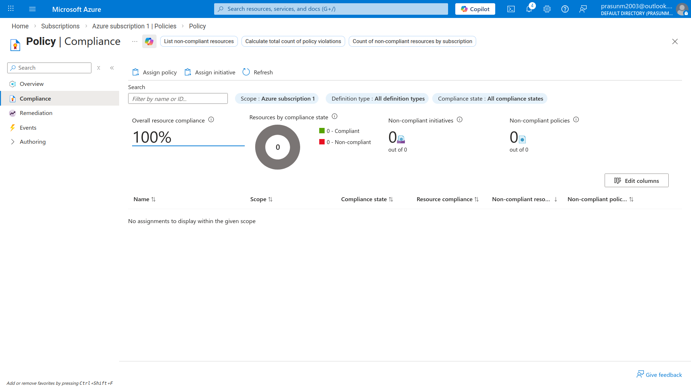
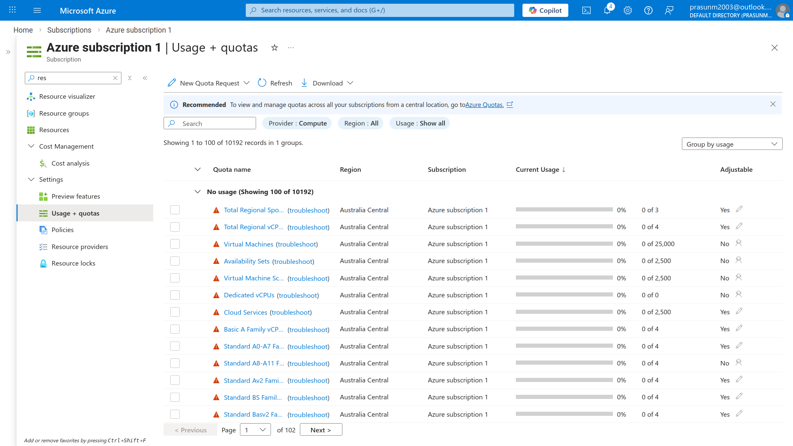

# Azure SLA, Service Lifecycle & Subscription Management

## Project Structure
```
.
├── README.md
└── Screenshots
    ├── 01_Subscription_Essentials.png
    ├── 02_Activity_Log.png
    ├── 03_Resource_Providers.png
    ├── 04_Policy_Compliance.png
    └── 05_Usage_Quotas.png
```

## What Was Done
1. Navigated to **Subscriptions → Azure subscription 1** and reviewed
   subscription ID, owner role, and active Azure Plan details
2. Opened **Activity Log** to inspect the audit trail of recent
   operations including resource group deletions and storage key listings
3. Browsed **Resource Providers** to identify which Azure services
   (e.g. Microsoft.AAD) are Registered or Available in the subscription
4. Opened **Azure Policy → Compliance** and verified 100% compliance
   score with zero non-compliant resources or policy assignments
5. Navigated to **Usage + Quotas** under the subscription to review
   regional compute limits and current utilization percentage ✅

## Key Concepts Learned

| Concept | Description |
|---|---|
| Subscription | Billing and access boundary for all Azure resources; identified by a unique Subscription ID |
| Azure Plan | The commercial offer type under which resources are billed (e.g. Pay-as-you-go, Free Trial) |
| Activity Log | Audit trail of all control-plane operations performed on the subscription — who did what and when |
| Resource Providers | Namespaces (e.g. Microsoft.Compute, Microsoft.AAD) that must be registered to use a service in a subscription — part of service lifecycle management |
| Service Lifecycle | Stages an Azure service goes through: Preview → GA (Generally Available) → Deprecated → Retired |
| Policy Compliance | Governance feature that enforces rules across resources; 100% score means all resources meet defined standards |
| Usage + Quotas | Regional limits set by Azure on compute/network resources; tracks current consumption vs maximum allowed |
| SLA | Service Level Agreement — Microsoft's uptime guarantee per service (e.g. 99.99% for VMs); tracked via Service Health |

## Architecture
```
Azure Subscription (Azure subscription 1)
├── Identity & Access  → Owner role assigned
├── Activity Log       → Full audit trail of operations
├── Resource Providers → Service lifecycle (Registered / Available)
├── Azure Policy       → 100% compliance, zero violations
└── Usage + Quotas     → Regional compute limits tracked
```

## Screenshots

### 01 — Subscription Essentials
*Shows Azure subscription 1 overview with Subscription ID, Owner role
assignment, and active Azure Plan — the foundational governance layer.*


### 02 — Activity Log
*Shows the audit trail of recent control-plane operations including
resource group deletions and storage key listings, demonstrating
subscription-level governance and traceability.*


### 03 — Resource Providers
*Shows the Resource Providers list with services like Microsoft.AAD
marked as Registered or Available — demonstrating service lifecycle
management within a subscription.*


### 04 — Policy Compliance
*Shows Azure Policy compliance dashboard with a 100% compliance score
and zero non-compliant resources, confirming all governance policies
are being met.*


### 05 — Usage + Quotas
*Shows regional compute quotas for Australia Central with 0% current
utilization against defined limits — demonstrating subscription-level
capacity and SLA planning awareness.*


## Cleanup
- No resources were created in this task
- All exploration was read-only portal navigation
- Zero cost incurred ✅

