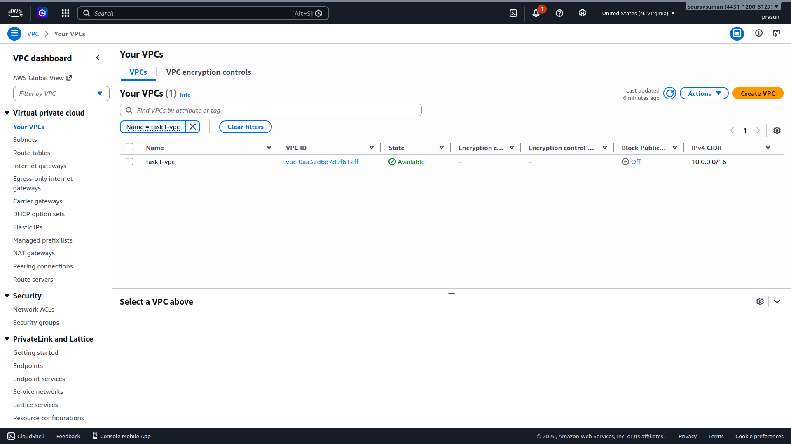
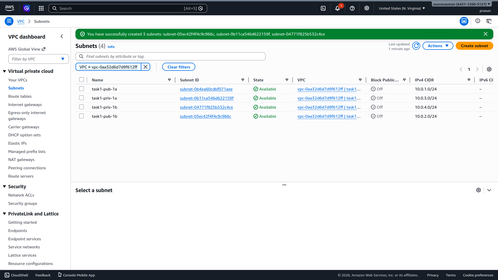
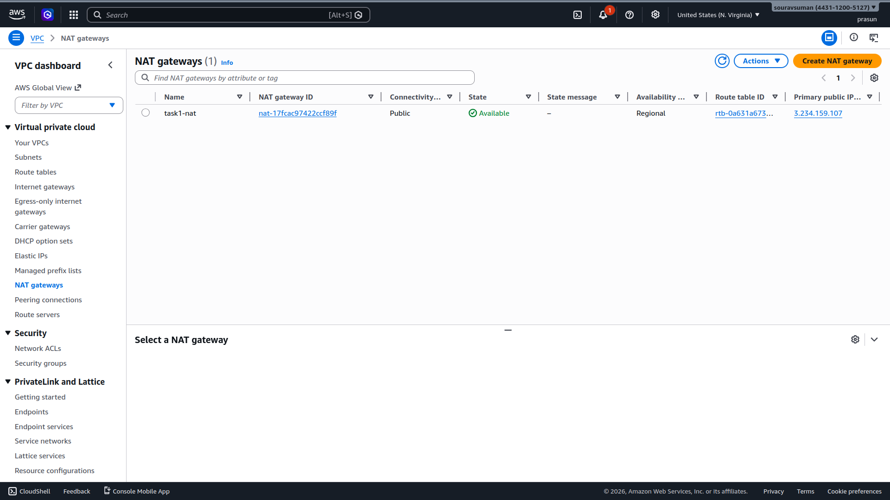
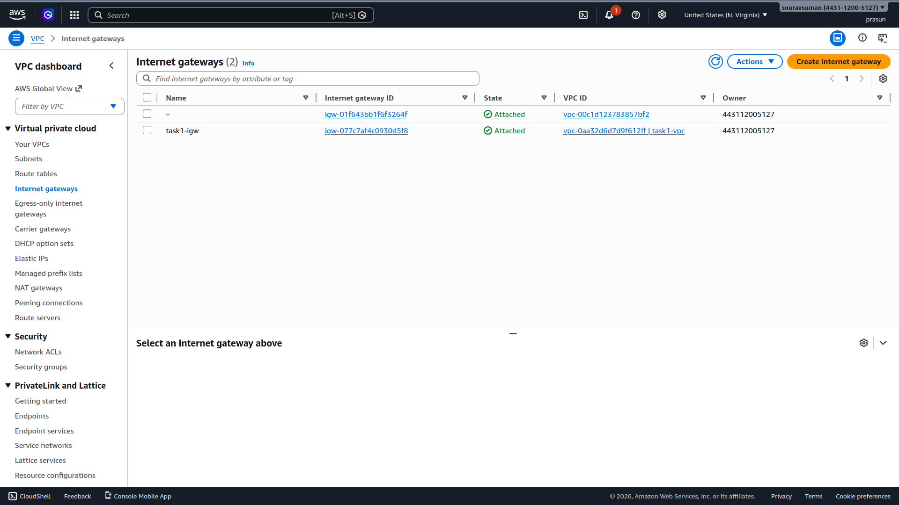
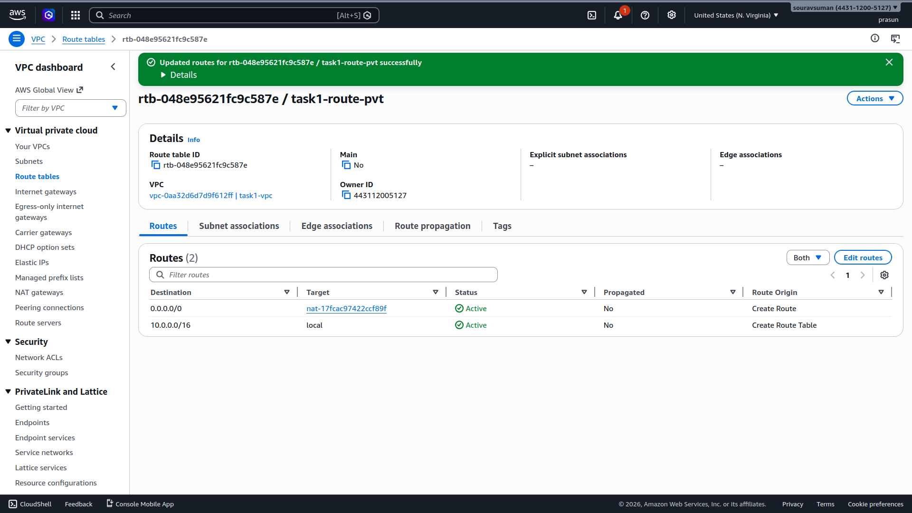
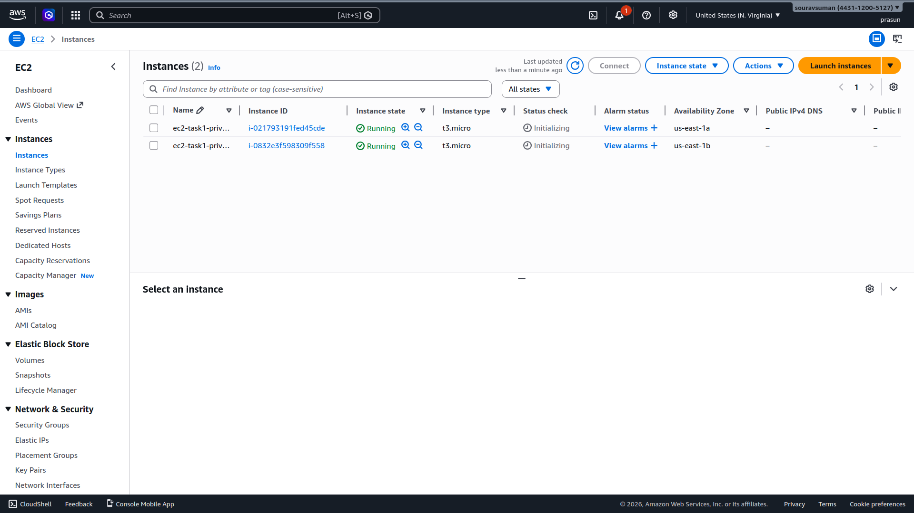
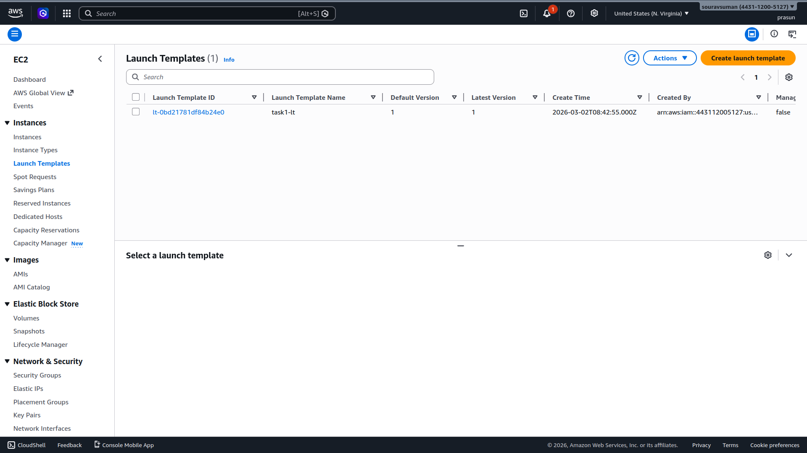
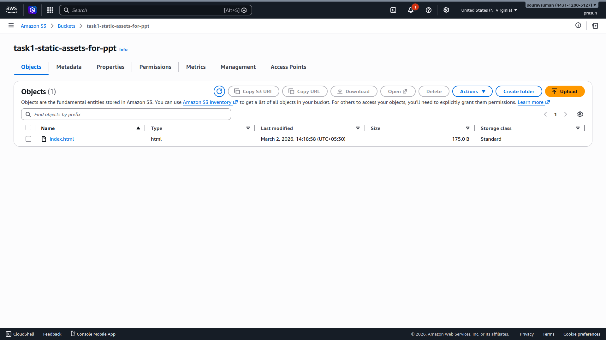
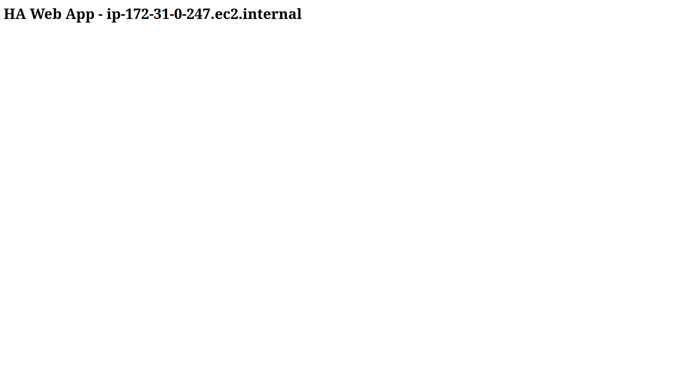
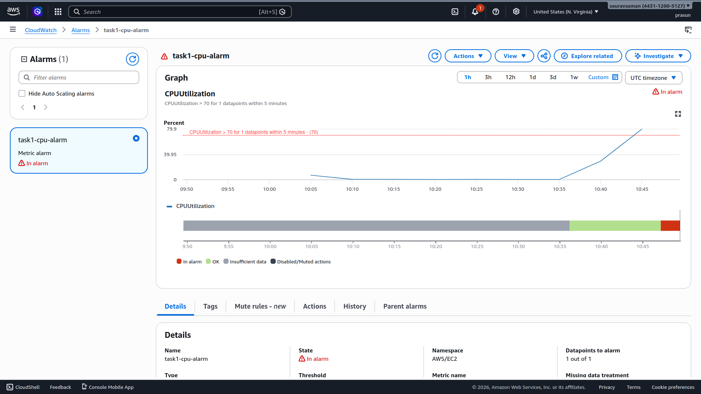

# AWS Multi-Region Highly Available Web Application

## Project Structure
```
.
├── README.md
├── index.html
├── userdata.sh
└── Screenshots
    ├── 01_VPC_with_CIDR.png
    ├── 02_Subnets.png
    ├── 03_nat_gateways.png
    ├── 04_Internet_Gateway.png
    ├── 05_Route_Tables.png
    ├── 06_The_EC2_instances.png
    ├── 07_Application_Load_Balancer.jpg
    ├── 08_Launch_Template.png
    ├── 09_s3_bucket_with_item.png
    ├── 10_AutoScaled_LoadBalancer_1.png
    ├── 11_AutoScaled_LoadBalancer_2.png
    └── 12_CloudWatch_Alarm.png
```

## What Was Done
1. Created custom VPC `task1-vpc` with CIDR `10.0.0.0/16`
2. Provisioned 4 subnets across `us-east-1a` and `us-east-1b` (2 public, 2 private)
3. Attached Internet Gateway and configured NAT Gateway for private subnet outbound access
4. Launched 2 private EC2 instances (`t3.micro`) with Apache web server via user data
5. Deployed internet-facing ALB across public subnets, forwarding HTTP:80 to `task1-tg`
6. Created Auto Scaling Group via Launch Template (`task1-lt`) with Min=2, Desired=2
7. Created S3 bucket `task1-static-assets-for-ppt` and uploaded `index.html`
8. Configured CloudWatch Alarm `task1-cpu-alarm` triggering at CPU > 70% — tested with `stress-ng` ✅

## Key Concepts Learned

| Concept | Description |
|---|---|
| VPC & Subnets | Isolated network divided into public (IGW-routed) and private (NAT-routed) tiers |
| Application Load Balancer | Distributes traffic across targets in multiple AZs for fault tolerance |
| Auto Scaling Group | Maintains desired instance count and scales out on high CPU load |
| NAT Gateway | Allows private EC2s to reach the internet without being publicly reachable |
| CloudWatch Alarm | Monitors CPUUtilization metric and triggers action when threshold is breached |

## Architecture
```
Internet
│
▼
Internet Gateway
│
▼
ALB (Public Subnets — us-east-1a / us-east-1b)
├──▶ EC2 Instance A (Private Subnet 1a)
└──▶ EC2 Instance B (Private Subnet 1b)
│
▼
NAT Gateway ──▶ Internet (Outbound Only)

S3: Static Assets | CloudWatch: CPU Monitoring
```
## Screenshots

### 01 — VPC with CIDR
*Custom `task1-vpc` with `10.0.0.0/16` CIDR block.*


### 02 — Subnets
*4 subnets across 2 AZs — 2 public, 2 private.*


### 03 — NAT Gateway
*`task1-nat` with Elastic IP for private subnet outbound access.*


### 04 — Internet Gateway
*`task1-igw` attached to `task1-vpc`.*


### 05 — Route Tables
*Private route table routing `0.0.0.0/0` to NAT Gateway.*


### 06 — EC2 Instances
*Two t3.micro instances running in private subnets — no public IPs.*


### 07 — Application Load Balancer
*Internet-facing ALB forwarding HTTP:80 to `task1-tg`.*


### 08 — Launch Template
*`task1-lt` used by ASG for standardized EC2 provisioning.*


### 09 — S3 Bucket
*`task1-static-assets-for-ppt` containing `index.html`.*


### 10 & 11 — ALB Load Balancing Proof
*Two browser requests routed to different backend instances — confirms round-robin load balancing.*



### 12 — CloudWatch Alarm Triggered
*`task1-cpu-alarm` in **In Alarm** state after `stress-ng` CPU spike above 70%.*
