# Azure Global Infrastructure + High Availability

## Project Structure
```
.
├── README.md
├── cloud-init.sh
└── Screenshots
    ├── 01_azure_resource_group.png
    ├── 02_azure_vnet_subnets.png
    ├── 03_azure_availability_set.png
    ├── 04_azure_vm_quota_error.png
    ├── 05_azure_quota_usage_details.png
    ├── 06_azure_lb_deployment_success.png
    ├── 07_azure_cpu_alert_config.png
    ├── 08_azure_storage_account.png
    ├── 09_azure_infrastructure_monitoring.png
    ├── 10_azure_web_connection_timeout.png
    ├── 11_azure_bastion_terminal.png
    ├── 12_azure_nsg_rules_config.png
    ├── 13_azure_vm1_web_success.png
    └── 14_azure_vm2_web_success.png
```

## What Was Done
1. Created Resource Group `task2-rg` in Switzerland North as the unified container for all task resources
2. Deployed Virtual Network `task2-vnet` with subnet `task2-subnet` (`10.0.1.0/24`) for internal VM communication
3. Created `task2-availability-set` with 2 fault domains and 2 update domains for VM-level fault tolerance
4. Attempted deployment of 4 VMs (2 AS + 2 AZ) — hit regional vCPU quota limit of 4 cores; deployed 2 VMs (`task2-vm-as-1` in Availability Set, `task2-vm-az-1` in Availability Zone 1) using `Standard_B1s` to stay within quota
5. Deployed internet-facing Standard Load Balancer `task2-lb` with public IP `20.250.61.109` and added both VMs to the backend pool
6. Configured Health Probe (`TCP:80`) and Load Balancing Rule (`HTTP:80`) to route and monitor traffic across backend VMs
7. Created Azure Monitor alert rule `task2-cpu-alert` triggering a Warning when CPU > 80% across VMs in `task2-rg`
8. Created Storage Account `task2storageprasun` (StorageV2) and enabled VM diagnostic logs for infrastructure monitoring
9. Diagnosed and resolved NSG misconfiguration — port 80 was missing from inbound rules, causing connection timeouts — added `Allow-HTTP-80` rule to fix it
10. Verified load balancer routing by accessing `http://20.250.61.109` — responses confirmed from both `task2-vm-as-1` and `task2-vm-az-1` ✅

## Key Concepts Learned

| Concept | Description |
|---|---|
| Resource Group | Logical container for all Azure resources — enables unified management, billing, and lifecycle control |
| Availability Set | Groups VMs across fault and update domains within a single datacenter to protect against hardware failures and planned maintenance |
| Availability Zone | Physically separate datacenters within a region — provides zone-level redundancy against datacenter-wide failures |
| Azure Load Balancer | Distributes inbound TCP/UDP traffic across healthy backend VMs using health probes and load balancing rules |
| NSG (Network Security Group) | Firewall rules controlling inbound/outbound traffic to VMs — missing port 80 was the root cause of the timeout |
| Azure Monitor | Unified monitoring service collecting metrics and logs; alert rules notify teams when thresholds are breached |
| Diagnostic Logs | VM-level telemetry (CPU, memory, network) stored in a Storage Account for audit and performance analysis |
| vCPU Quota | Regional limit on total CPU cores per subscription — exceeded when deploying 4 VMs; resolved by using `Standard_B1s` (1 vCPU each) |

## Architecture
```
Internet
│
▼
Azure Load Balancer (Public IP: 20.250.61.109)
│
├──▶ task2-vm-as-1 (Availability Set — Fault Domain 0)
└──▶ task2-vm-az-1 (Availability Zone 1)

task2-vnet (10.0.0.0/16)
└── task2-subnet (10.0.1.0/24)

Monitoring: Azure Monitor → task2-cpu-alert (CPU > 80%)
Storage: task2storageprasun → Diagnostic Logs
```

## Note on VM Quota Constraint
> During deployment, the Switzerland North region had a **Total Regional vCPU limit of 4 cores**. Deploying all 4 VMs (2 AS + 2 AZ) simultaneously required 4+ vCPUs and triggered a validation failure. The task was completed with **2 VMs** — one in an Availability Set and one in an Availability Zone — using `Standard_B1s` (1 vCPU each) to stay within quota while still demonstrating both HA deployment strategies.

## Screenshots

### 01 — Resource Group
*`task2-rg` created in Switzerland North as the container for all task resources.*
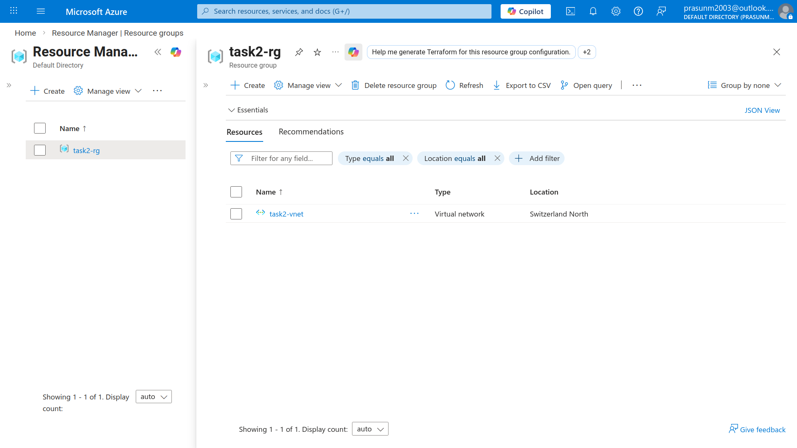

### 02 — VNet and Subnet
*`task2-vnet` with `task2-subnet` (`10.0.1.0/24`) providing internal network isolation.*
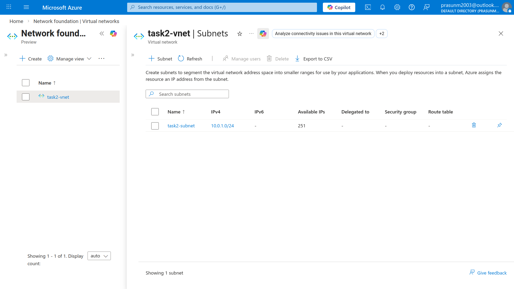

### 03 — Availability Set
*`task2-availability-set` configured with 2 fault domains and 2 update domains.*
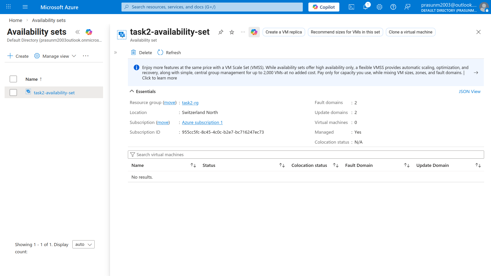

### 04 — VM Quota Validation Error
*Validation failure when attempting to deploy 4 VMs — Total Regional Cores quota (4) exceeded in Switzerland North.*
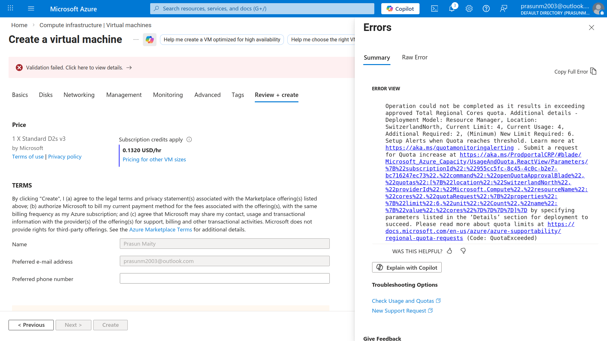

### 05 — Quota Usage Details
*`My Quotas` dashboard showing 100% vCPU usage (4/4 cores) confirming the regional constraint.*
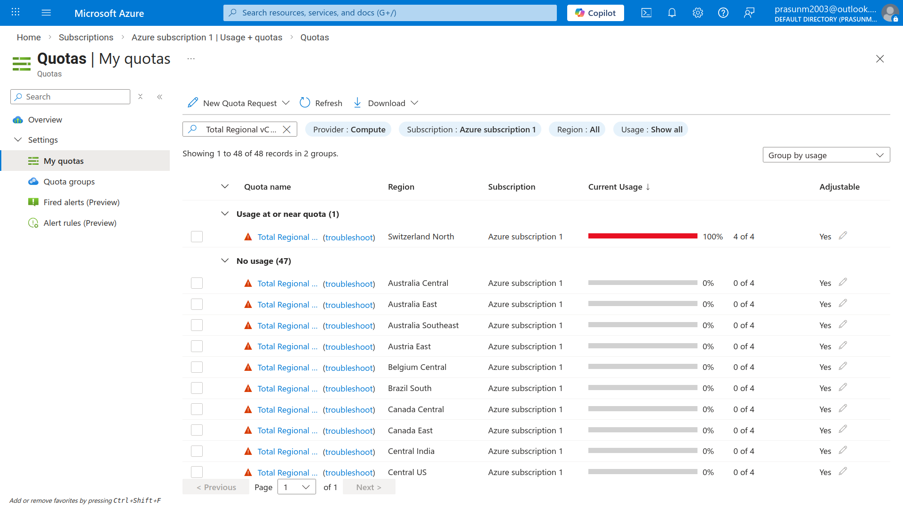

### 06 — Load Balancer Deployed
*`task2-lb` successfully deployed with public IP `20.250.61.109`, backend pool, health probe, and LB rule configured.*
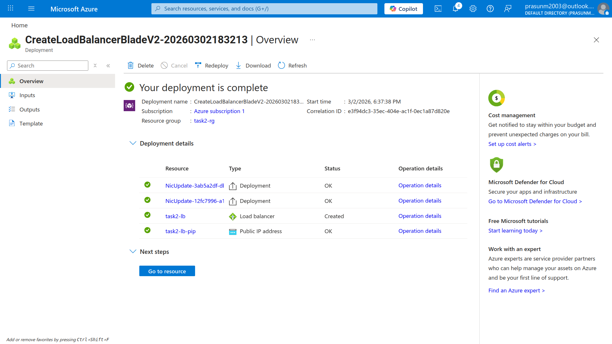

### 07 — CPU Alert Rule
*`task2-cpu-alert` configured on Azure Monitor to trigger a Warning when CPU > 80% across `task2-rg` VMs.*
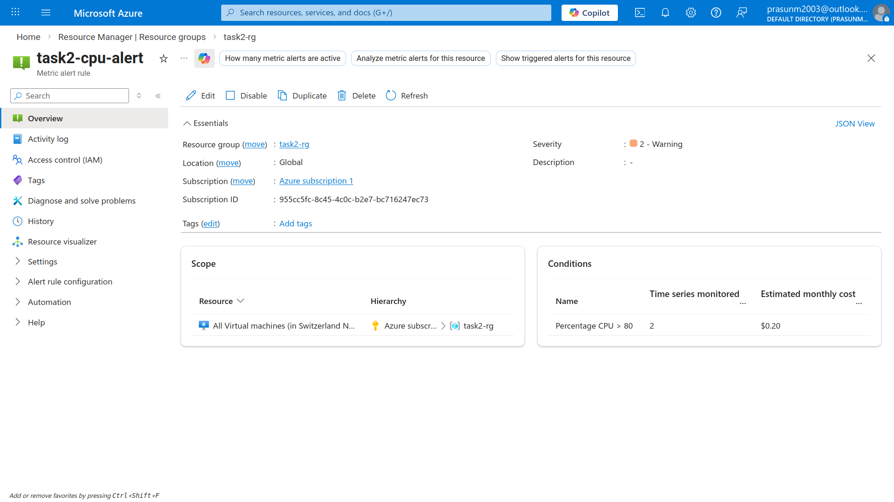

### 08 — Storage Account
*`task2storageprasun` (StorageV2) created to store VM diagnostic logs and infrastructure telemetry.*
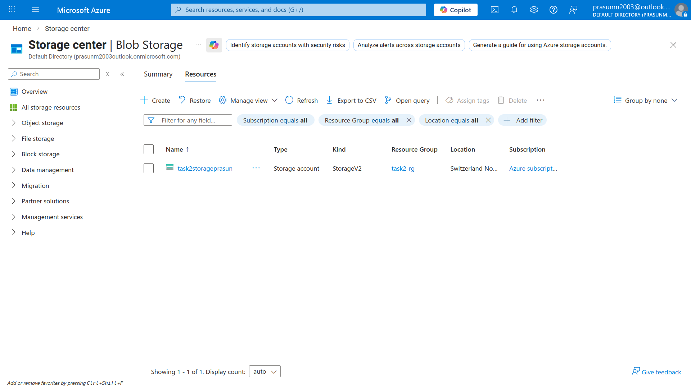

### 09 — Infrastructure Monitoring
*Azure Monitor dashboard showing CPU, Memory, and Network metrics across compute instances.*
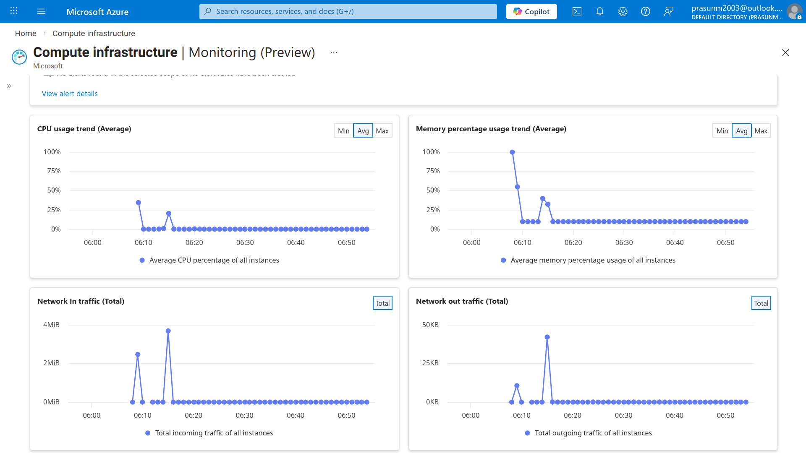

### 10 — Bastion Terminal
*Azure Bastion used to connect to `task2-vm-az-1` and verify Apache web content via `cat /var/www/html/index.html`.*
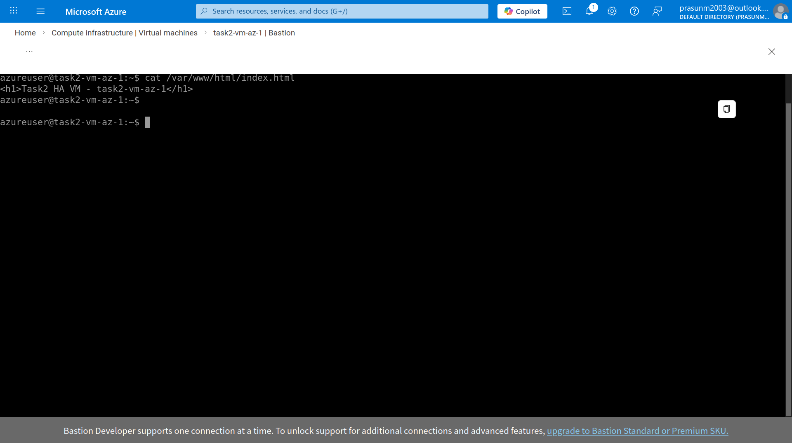

### 11 — NSG Rules Fix
*NSG inbound rules for `task2-vm-az-1-nsg` — identified missing port 80 rule; `Allow-HTTP-80` added to resolve the timeout.*
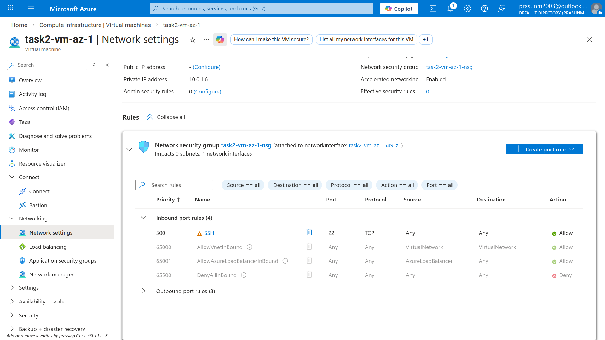

### 12 — VM1 Web Confirmed
*Browser successfully served `Task2 HA VM - task2-vm-as-1` via the Load Balancer public IP.*


### 13 — VM2 Web Confirmed
*Browser successfully served `Task2 HA VM - task2-vm-az-1` on refresh — confirms LB is routing across both backends.*
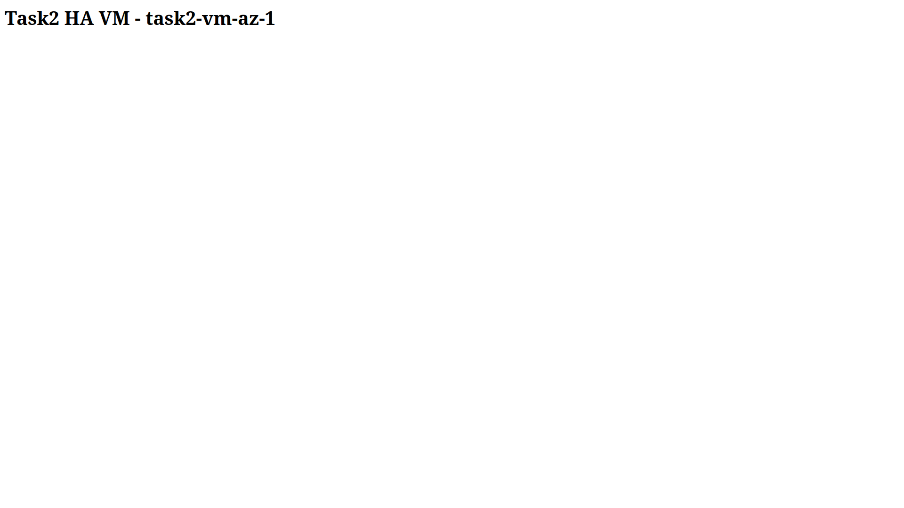

## Cleanup
- Stop and delete both VMs (`task2-vm-as-1`, `task2-vm-az-1`)
- Delete Load Balancer and Public IP (`task2-lb-pip`)
- Delete Storage Account (`task2storageprasun`)
- Delete Virtual Network (`task2-vnet`)
- Delete Availability Set (`task2-availability-set`)
- Delete Resource Group `task2-rg` (auto-removes all remaining resources) ✅
