# Hybrid Architecture Simulation (AWS)

## Project Structure
```
Task4-Hybrid-Architecture/
├── README.md
└── Screenshots/
    ├── 01_pub_subnet_auto_assign_ip.png
    ├── 02_subnets_overview.png
    ├── 03_internet_gateway_attached.png
    ├── 04_route_tables.png
    ├── 05_vpc_resource_map.png
    ├── 06_security_groups.png
    ├── 07_ec2_instances.png
    ├── 08_private_vm_connect_fail.png
    ├── 09_bastion_connect_success.png
    ├── 10_ssh_tunnel_private_vm.png
    ├── 11_private_vm_ping_fail.png
    └── 12_bastion_ping_success.png
```

## What Was Done
1. Created `task4-vpc` with public subnet `10.0.1.0/24` and private subnet `10.0.2.0/24`
2. Attached `task4-igw` to VPC and configured `task4-route-pub` with `0.0.0.0/0 → IGW`
3. Configured `task4-route-pvt` with local route only — no IGW, no NAT (full isolation)
4. Created `task4-bastion-sg` (SSH from internet) and `task4-private-sg` (SSH from bastion only)
5. Launched `task4-bastion` in public subnet with public IP and `task4-private-vm` in private subnet with no public IP
6. SSH'd into Bastion → then SSH'd into private VM using it as a jump server ✅
7. Verified private VM is unreachable directly from internet (EC2 Instance Connect blocked)
8. Confirmed isolation: `ping google.com` fails on private VM, succeeds on Bastion ✅

## Key Concepts

| Concept | Description |
|---|---|
| Bastion Host | A hardened EC2 in the public subnet acting as the only entry point to private resources |
| Private Subnet Isolation | No IGW or NAT route = no inbound or outbound internet access |
| Security Group Chaining | Private VM SG only allows SSH from the Bastion SG — not from `0.0.0.0/0` |
| Jump Server | SSH hop: Local → Bastion (public IP) → Private VM (private IP only) |

## Traffic Flow
```
Internet
│
▼
task4-bastion (Public Subnet 10.0.1.0/24 — has Public IP)
│
└──SSH──▶ task4-private-vm (Private Subnet 10.0.2.0/24 — no Public IP)
│
└── ping google.com → ❌ No route (isolated)
```

## Screenshots

| # | Screenshot | Description |
|---|-----------|-------------|
| 01 | 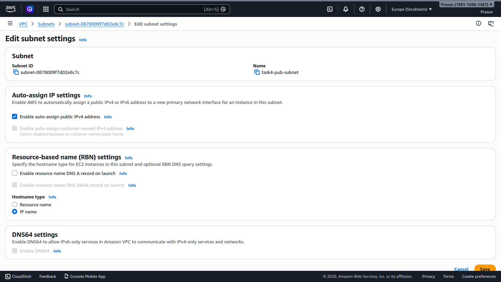 | Public subnet with auto-assign public IP enabled |
| 02 | 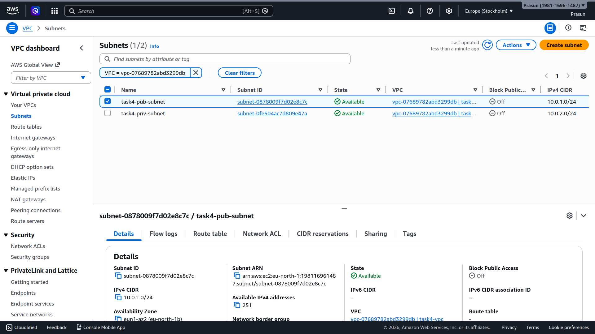 | Both subnets in `task4-vpc` |
| 03 | 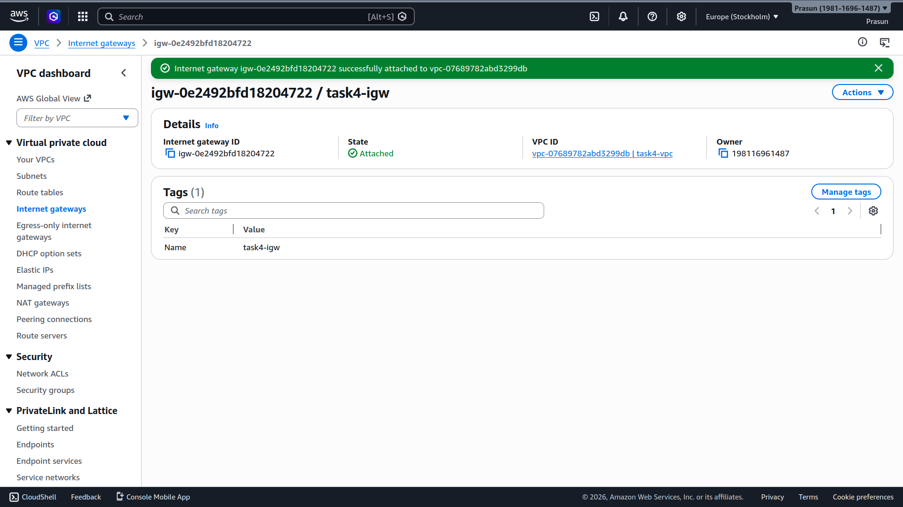 | `task4-igw` attached to VPC |
| 04 | 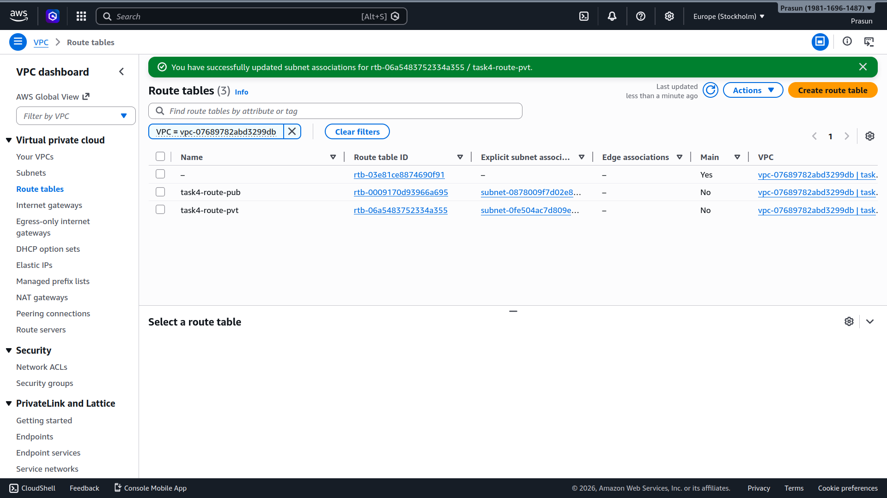 | Public + private route tables configured |
| 05 | 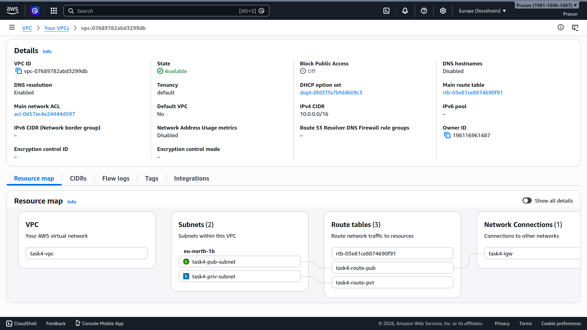 | VPC resource map showing full architecture |
| 06 | 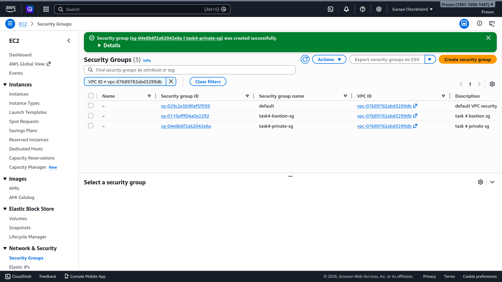 | `task4-bastion-sg` and `task4-private-sg` created |
| 07 | 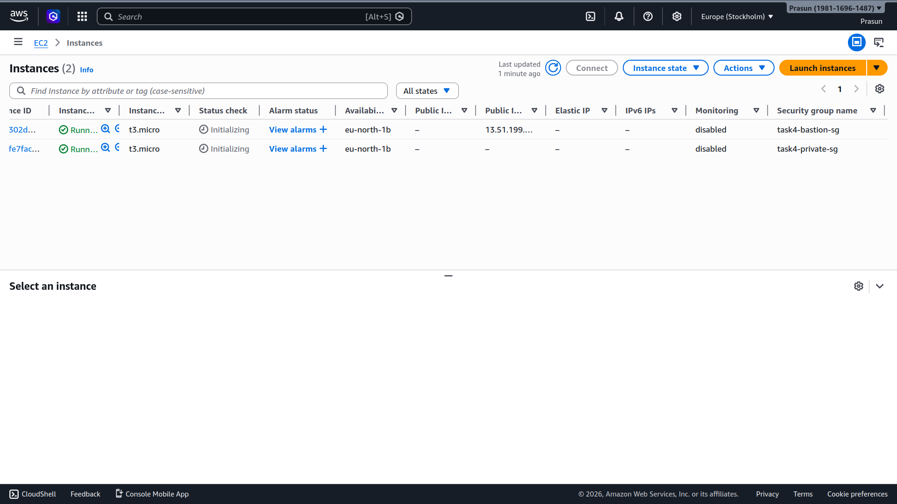 | Bastion with public IP, private VM with no public IP |
| 08 | 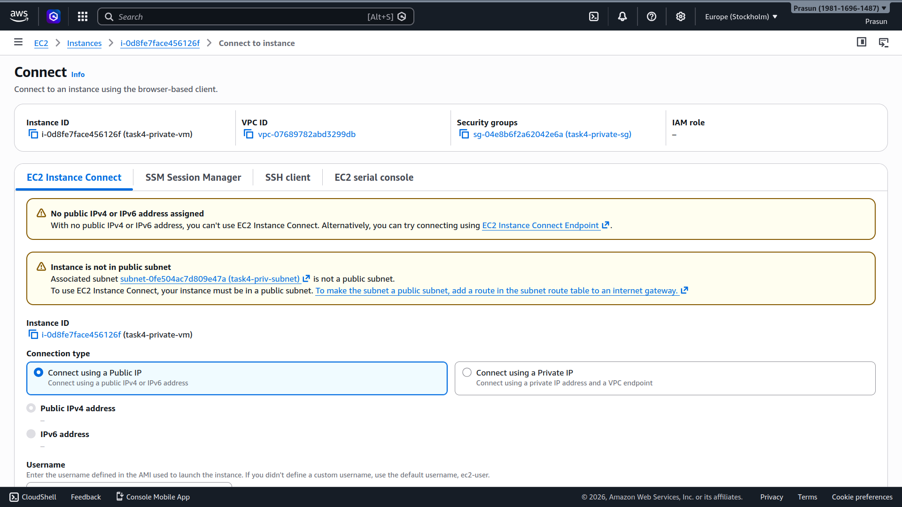 | Direct connection to private VM blocked — no public IP |
| 09 | 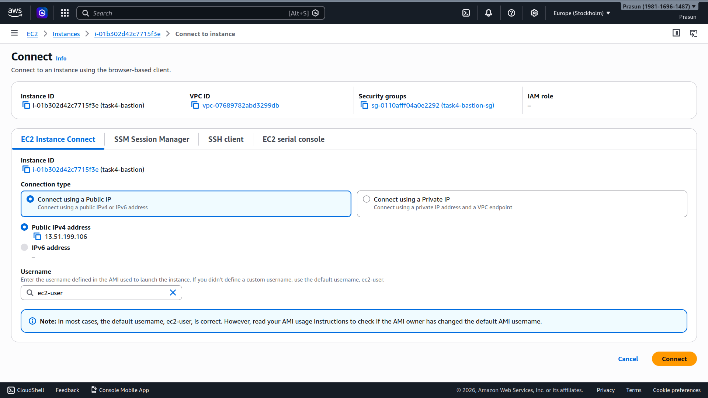 | Bastion SSH connection successful |
| 10 | 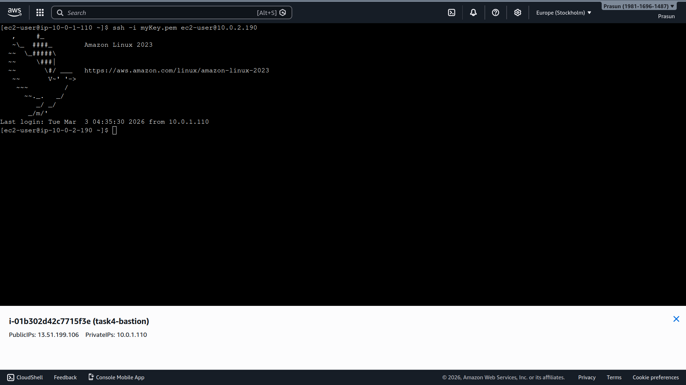 | SSH from Bastion → private VM successful |
| 11 | 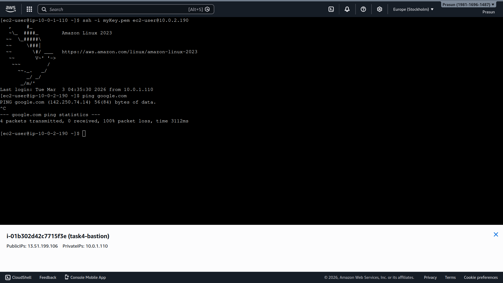 | `ping google.com` from private VM — 100% packet loss |
| 12 | 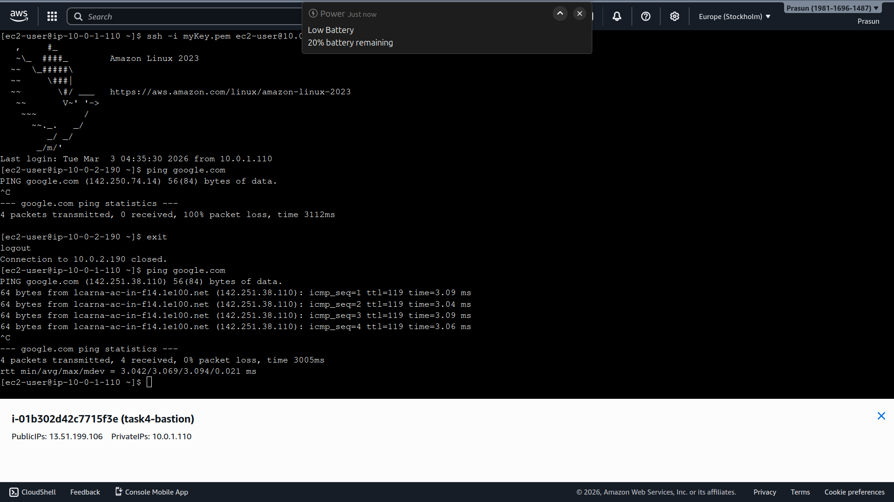 | `ping google.com` from Bastion — 0% packet loss |

## Cleanup
- Terminate `task4-bastion` and `task4-private-vm`
- Delete security groups `task4-bastion-sg` and `task4-private-sg`
- Detach and delete `task4-igw`
- Delete subnets and route tables
- Delete `task4-vpc` ✅

