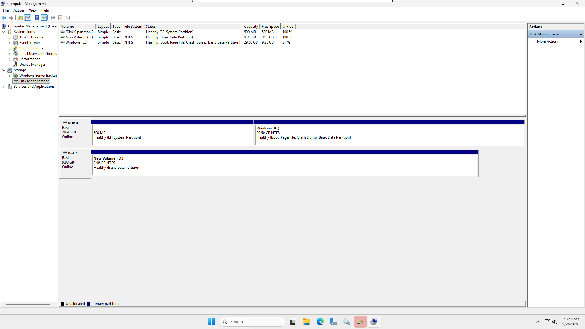

# Disk Partitioning — MBR (Ubuntu) & GPT (Windows Server)

## Project Structure
```
.
├── Commands.txt
├── README.md
└── Screenshots
    ├── MBR_Ubuntu_fdisk_helper.png
    ├── MBR_Ubuntu_fdisk.png
    └── GPT_Windows_ServerManager.png
```

## What Was Done
1. On Ubuntu EC2: identified secondary disk with `lsblk`, opened with `sudo fdisk /dev/nvme1n1`
2. Created primary partition using `n → p → 1 → Enter → Enter → w` inside fdisk interactive prompt
3. Formatted partition: `sudo mkfs.ext4 /dev/nvme1n1p1`
4. Mounted at `/mnt/mypartition` and verified with `df -h` ✅
5. On Windows Server EC2: opened **Server Manager → File and Storage Services → Volumes → Disks**
6. Right-clicked uninitialized disk → **Initialize** (GPT by default) → **New Volume** → NTFS, drive letter assigned
7. Volume appeared Online in Server Manager and accessible in File Explorer ✅

## Screenshots
### MBR Partitioning — Ubuntu (fdisk)
*Shows lsblk, fdisk partition creation on /dev/nvme1n1, and df -h confirming mounted partition.*


### GPT Partitioning — Windows Server (Server Manager)
*Shows initialized GPT disk and new NTFS volume created via File and Storage Services.*

