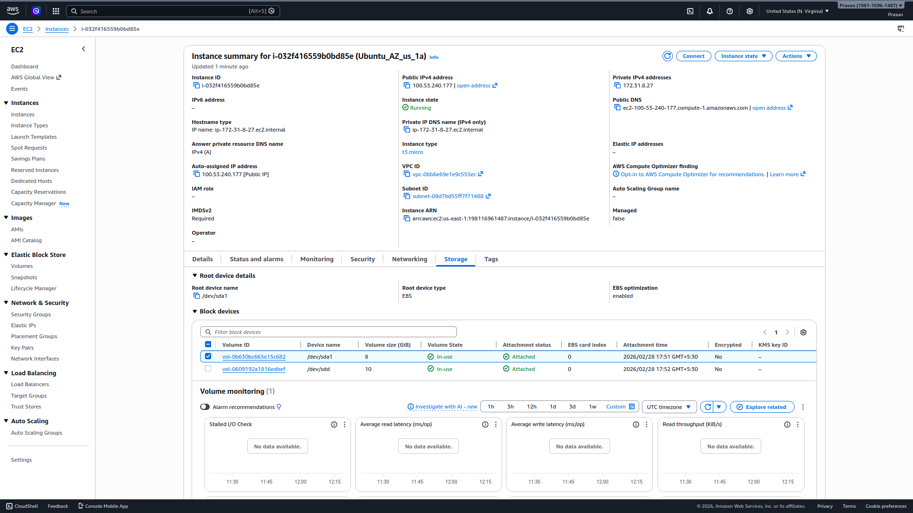
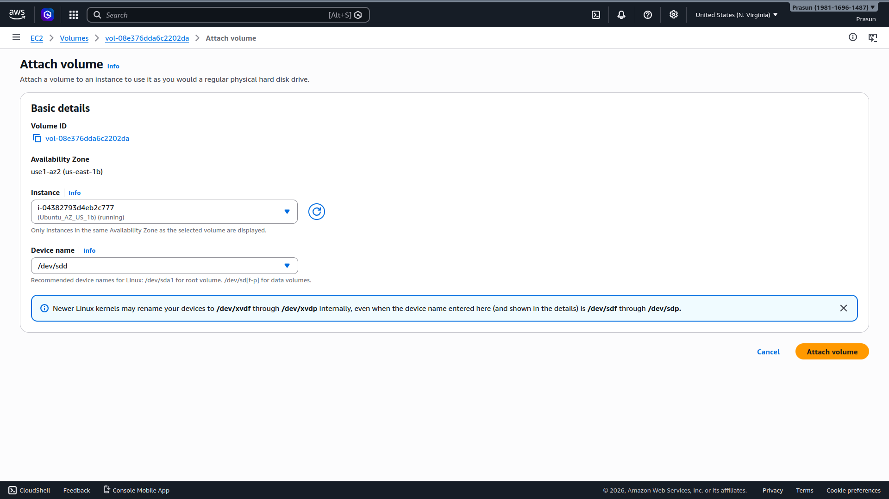
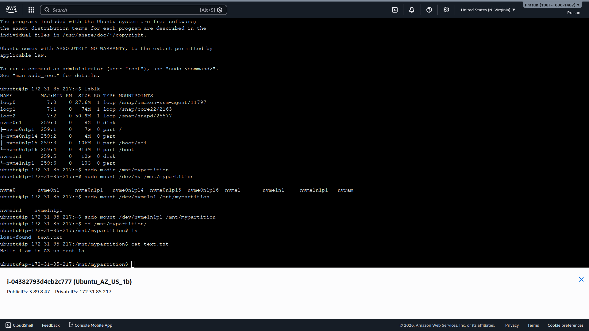

# EBS Disk Partitioning & Cross-AZ Migration

## Project Structure
```
.
├── README.md
└── Screenshots
    ├── 01_EC2_1a_Volume_Attached.png
    ├── 02_Attach_Volume_1b_Console.png
    └── 03_Terminal_1b_File_Verified.png
```

## What Was Done
1. Attached a 10 GiB EBS volume to EC2 in us-east-1a; partitioned with `fdisk /dev/nvme1n1`, formatted with `mkfs.ext4`
2. Mounted at `/mnt/mypartition` and wrote `text.txt` with content: `"Hello i am in AZ us-east-1a"`
3. Created snapshot of the 10 GiB volume via **Actions → Create Snapshot**; waited for `pending → completed`
4. Created new EBS volume from snapshot in **us-east-1b**; attached to instance `Ubuntu_AZ_US_1b` at `/dev/sdd`
5. On us-east-1b instance: mounted `/dev/nvme1n1p1` → ran `cat text.txt` → content intact ✅
6. Confirmed EBS snapshots enable data migration across Availability Zones

## Screenshots
### 01 — EC2 Instance (us-east-1a) — Volume Attached


### 02 — Attaching Snapshot Volume to us-east-1b


### 03 — File Verified on us-east-1b

