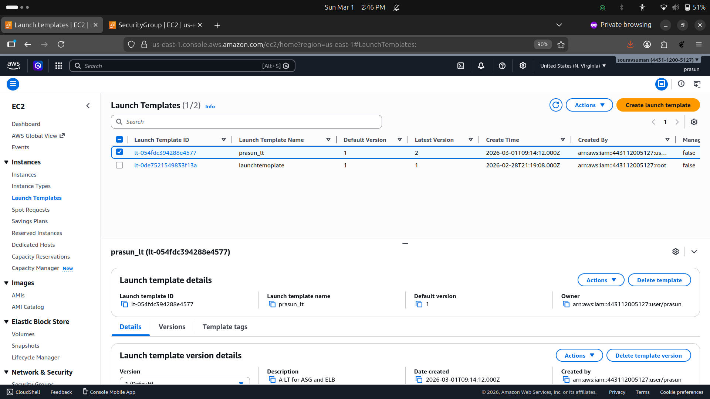
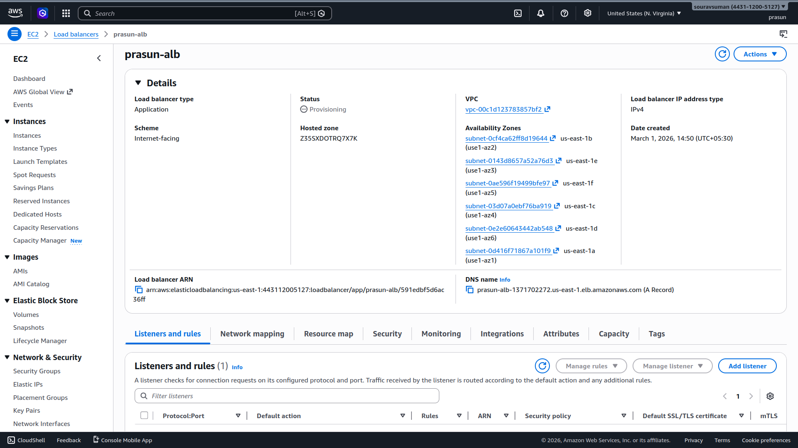
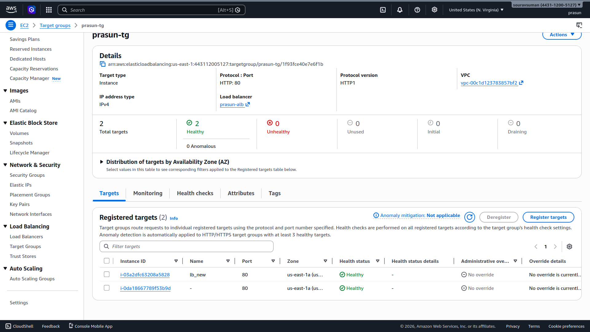
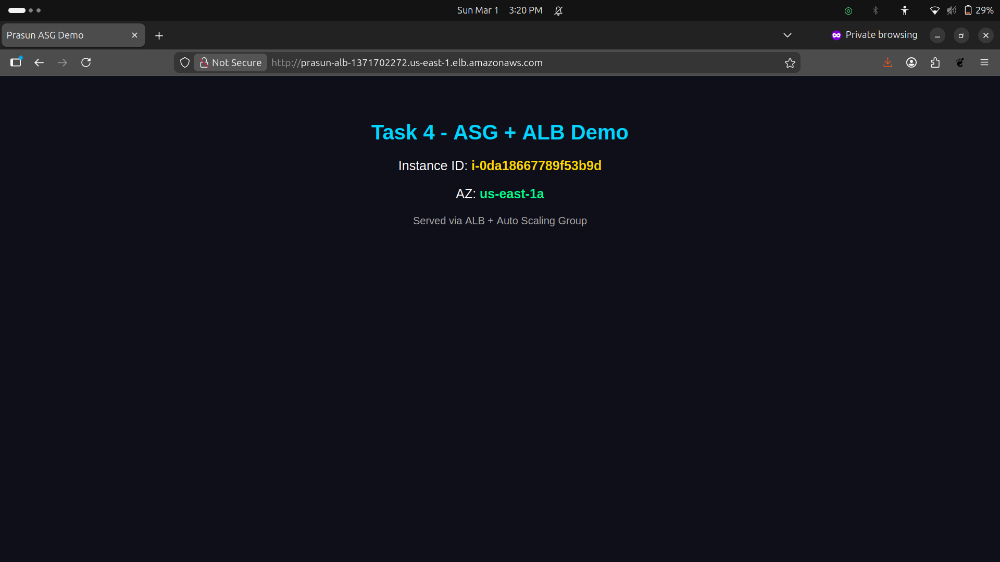

# ASG + ALB — Auto Scaling Group with Load Balancer

## Project Structure
```
.
├── README.md
└── Screenshots
    ├── 01_Launch_Template.png
    ├── 02_ALB_Details.png
    ├── 03_Target_Group_Healthy.png
    ├── 04_Browser_Instance1.png
    └── 05_Browser_Instance2.png
```

## What Was Done
1. Created Launch Template `prasun_lt` (Ubuntu 24.04, t2.micro) with User Data to install Nginx and serve a custom HTML page showing Instance ID and AZ fetched from EC2 metadata
2. Created Application Load Balancer `prasun-alb` — Internet-facing, HTTP:80, spanning 6 AZs in us-east-1
3. Created Target Group `prasun-tg` (HTTP:80, health check `/`) — attached to `prasun-alb`
4. Created Auto Scaling Group `prasun-asg` — Desired: 2, Min: 1, Max: 3, attached to `prasun-tg`
5. ASG launched 2 EC2 instances across availability zones — both registered to target group automatically
6. Both instances passed ELB health checks → status: **Healthy** ✅
7. Accessed ALB DNS `prasun-alb-1371702272.us-east-1.elb.amazonaws.com` — refreshing showed **different Instance IDs**, confirming load balancing across instances ✅

## Screenshots

### 01 — Launch Template
*Shows `prasun_lt` with Ubuntu AMI, t2.micro, and User Data script configured.*


### 02 — ALB Details
*Shows `prasun-alb` as Internet-facing Application Load Balancer across multiple AZs with DNS name.*


### 03 — Target Group: Both Instances Healthy
*Shows `prasun-tg` with 2 registered targets — both in **Healthy** state on port 80.*


### 04 — Browser: Instance 1
*ALB URL serving from `i-0da18667789f53b9d` in `us-east-1a`.*


### 05 — Browser: Instance 2
*Same ALB URL refreshed — now serving from `i-03a2dfc63208a5828`, confirming load balancer routing.*


