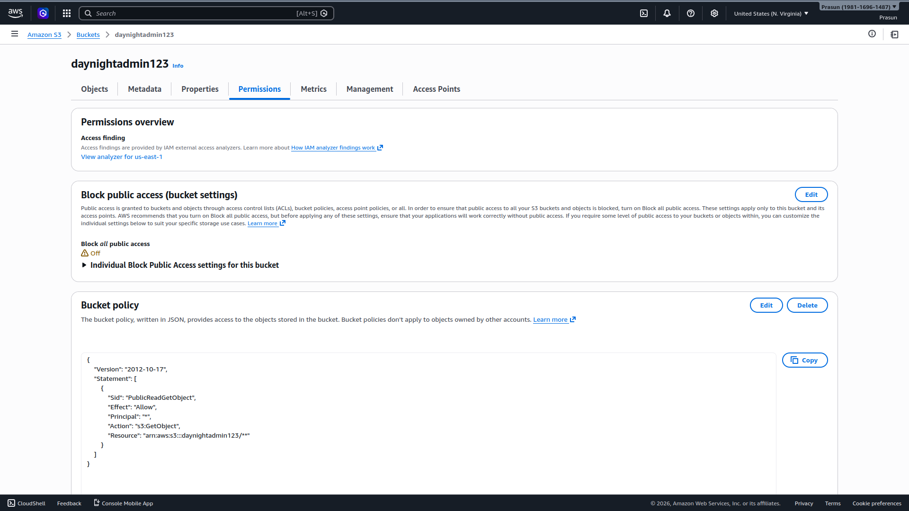
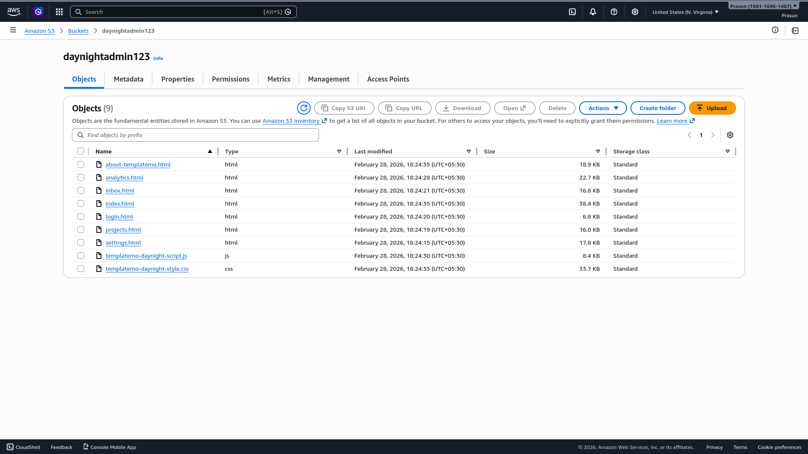
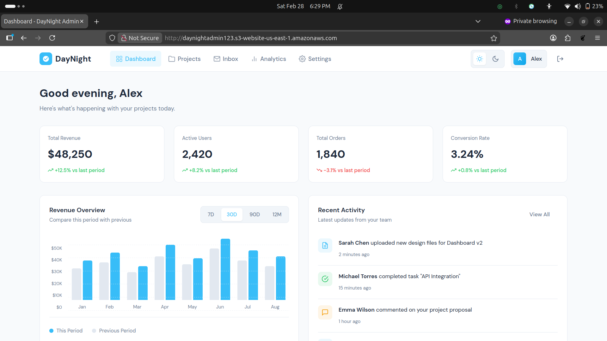

# Static Website Hosting on Amazon S3

## Project Structure
```
.
├── README.md
└── Screenshots
    ├── 01_S3_Bucket_Objects.png
    ├── 02_S3_Bucket_Policy.png
    └── 03_Live_Website.png
```

## What Was Done
1. Created S3 bucket `daynightadmin123` in us-east-1; turned **Block all public access → Off**
2. Uploaded 9 static files (HTML/CSS/JS — DayNight Admin template)
3. Enabled **Static website hosting** under Properties tab; index document: `index.html`
4. Applied bucket policy with `s3:GetObject` for `Principal: *` to allow public read access
5. Accessed website via S3 endpoint: `http://daynightadmin123.s3-website-us-east-1.amazonaws.com`
6. DayNight Admin Dashboard loaded successfully via browser ✅

## Screenshots
### 01 — S3 Bucket Objects
*All 9 uploaded files inside `daynightadmin123` bucket.*


### 02 — Bucket Policy & Public Access
*Block Public Access Off and PublicReadGetObject policy applied.*


### 03 — Live Website
*DayNight Admin Dashboard served via S3 static website endpoint.*

