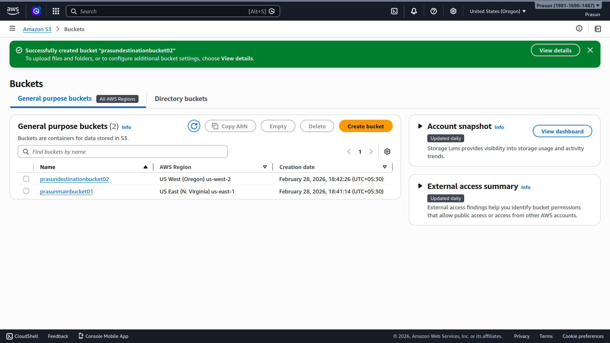
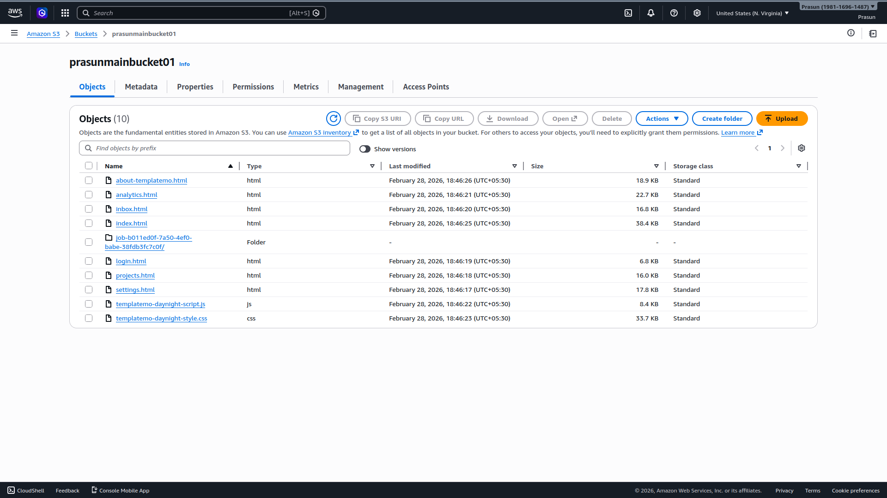
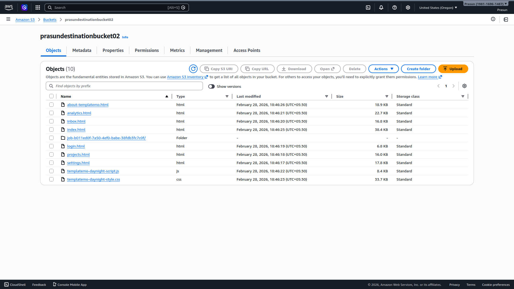
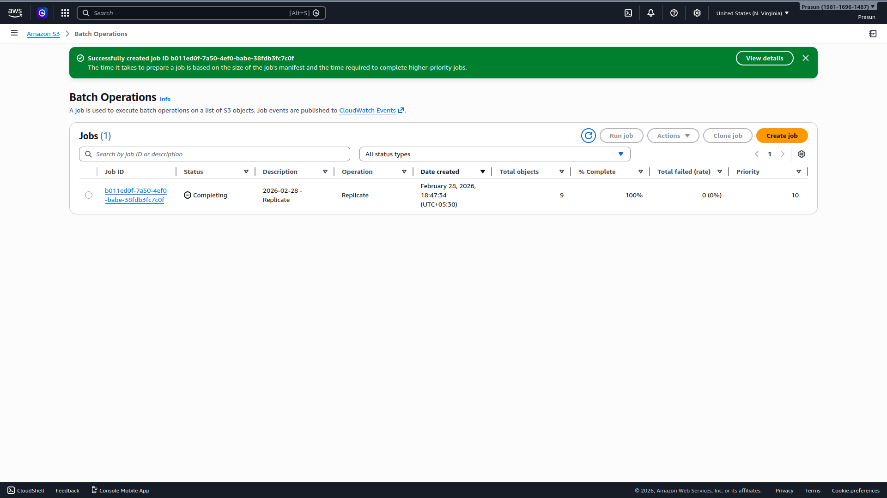
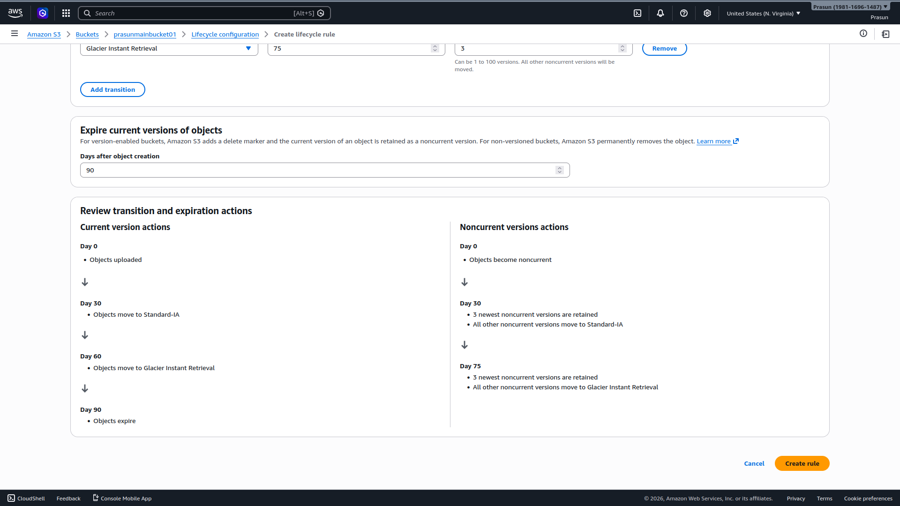
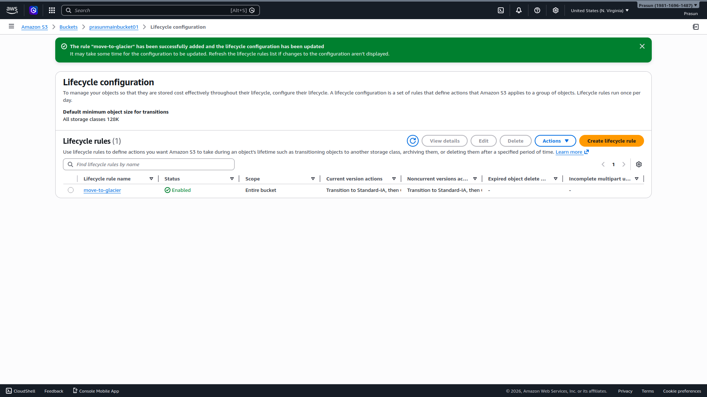

# S3 Replication & Lifecycle Policy

## Project Structure
```
.
├── README.md
└── Screenshots
    ├── 01_Two_Buckets_Created.png
    ├── 02_Source_Bucket_Objects.png
    ├── 03_Batch_Replication_Job.png
    ├── 04_Destination_Bucket_Replicated.png
    ├── 05_Lifecycle_Rule_Preview.png
    └── 06_Lifecycle_Rule_Enabled.png
```

## What Was Done
1. Created source bucket `prasunmainbucket01` (us-east-1) and destination `prasundestinationbucket02` (us-west-2); versioning enabled on both
2. Configured CRR rule `replicate-all` — scope: entire bucket, IAM role auto-created by AWS
3. Ran S3 Batch Operations job to replicate existing objects → **9 objects, 100% complete, 0 failed** ✅
4. Verified destination bucket (us-west-2) contains all 10 objects (9 files + 1 batch report folder) ✅
5. Created Lifecycle rule `move-to-glacier` on source bucket: Day 30 → Standard-IA, Day 60 → Glacier Instant, Day 90 → Expire
6. Noncurrent versions: Day 30 → Standard-IA, Day 75 → Glacier (retaining 3 newest versions)
7. Lifecycle rule status: **Enabled** ✅

## Screenshots
### 01 — Two Buckets Created
*Both `prasunmainbucket01` (us-east-1) and `prasundestinationbucket02` (us-west-2) listed in S3.*


### 02 — Source Bucket Objects
*All 10 objects in `prasunmainbucket01` with versioning enabled.*


### 03 — Batch Replication Job
*Batch Operations job at 100% — 9 objects replicated, 0 failed.*


### 04 — Destination Bucket Replicated
*`prasundestinationbucket02` (us-west-2) with all 10 objects replicated.*


### 05 — Lifecycle Rule Preview
*Full transition and expiration timeline before rule creation.*


### 06 — Lifecycle Rule Enabled
*`move-to-glacier` rule active under Lifecycle configuration.*

