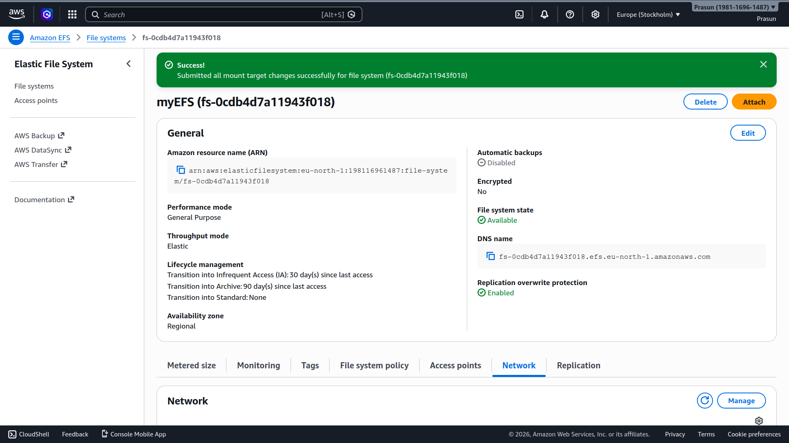
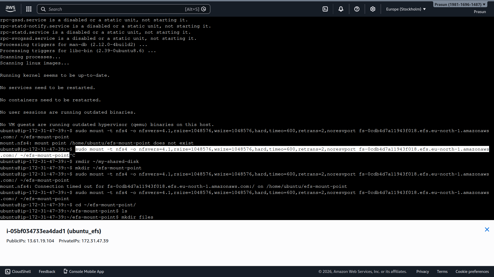

# EFS — Shared Storage Across Multiple EC2 Instances

Created an Amazon EFS file system and mounted it on two Ubuntu EC2 instances in different Availability Zones to demonstrate shared, scalable NFS storage.

---

## Project Structure
```
.
├── README.md
└── Screenshots
    ├── 01_EFS_Created.png
    ├── 02_Instance1_Mount_and_Write.png
    └── 03_Instance2_File_Verified.png
```
---

## EFS Details

| Field | Value |
|---|---|
| File System Name | `myEFS` |
| File System ID | `fs-0cdb4d7a11943f018` |
| Region | `eu-north-1` (Stockholm) |
| DNS Name | `fs-0cdb4d7a11943f018.efs.eu-north-1.amazonaws.com` |
| Performance Mode | General Purpose |
| Throughput Mode | Elastic |
| Availability Zone | Regional |

---

## EC2 Instances

| Instance | ID | Private IP | AZ |
|---|---|---|---|
| ubuntu_efs (1) | i-05bf034733ea4dad1 | 172.31.47.39 | eu-north-1a |
| ubuntu_efs (2) | i-0c13748b7df85046e | 172.31.36.166 | eu-north-1b |

---

## What Was Done

### Step 1 — Created EFS File System
- AWS Console → EFS → **Create file system**
- Name: `myEFS`, VPC: default, Mode: General Purpose

### Step 2 — Configured Security Group
- Created SG with **inbound NFS TCP port 2049** open
- Attached SG to the **EFS mount target** (root cause of initial timeout errors)

### Step 3 — Installed NFS Client (Both Instances)
```bash
sudo apt update
sudo apt install nfs-common -y
```

### Step 4 — Mounted EFS (Both Instances)
```bash
sudo mkdir ~/efs-mount-point
sudo mount -t nfs4 -o nfsvers=4.1,rsize=1048576,wsize=1048576,hard,timeo=600,retrans=2,noresvport \
fs-0cdb4d7a11943f018.efs.eu-north-1.amazonaws.com:/ ~/efs-mount-point
```

### Step 5 — Wrote File on Instance 1
```bash
cd ~/efs-mount-point
echo "Hello from 13.61.19.104" > text.txt
```

### Step 6 — Verified on Instance 2
```bash
cd ~/efs-mount-point
ls          # files  text.txt
cat text.txt  # Hello from 13.61.19.104 ✅
```

---

## Screenshots

### 01 — EFS File System Created
*Shows `myEFS` (fs-0cdb4d7a11943f018) in Available state with mount target changes successfully submitted.*


### 02 — Instance 1: Mount and Write
*Shows EFS mounted on `ubuntu_efs` (172.31.47.39) and `text.txt` written with content `Hello from 13.61.19.104`.*


### 03 — Instance 2: File Verified
*Shows `ubuntu_efs` (172.31.36.166) reading the same `text.txt` — confirming shared storage across both instances.*


---

## Key Issue Faced

> **EFS mount was timing out** on all attempts. Root cause: the EFS mount target had **no Security Group attached**, so port 2049 (NFS) was completely blocked. Fixed by attaching a Security Group with inbound NFS rule to the EFS mount target.

---

## Result

Both EC2 instances in different AZs successfully share the same EFS filesystem. A file written on Instance 1 was immediately readable on Instance 2 — confirming **real-time shared NFS storage** across Availability Zones.

