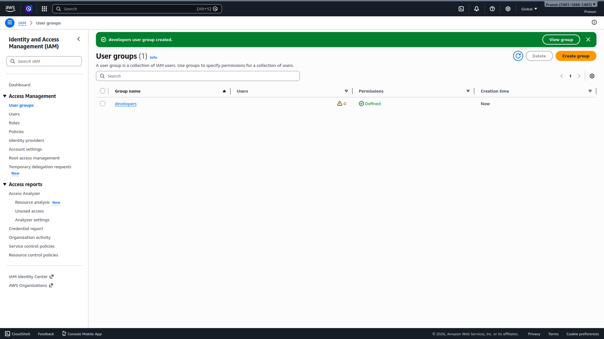
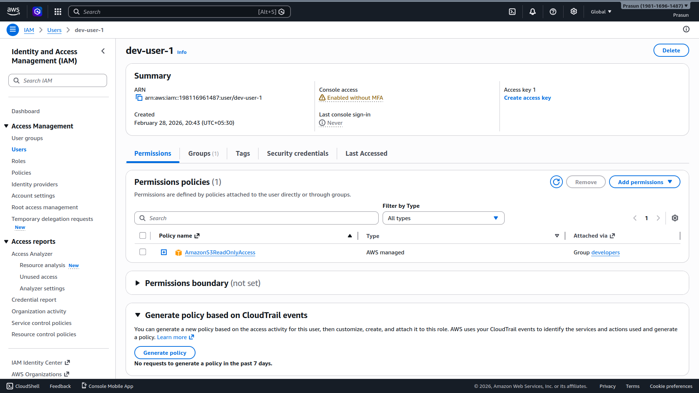

# IAM Users and Groups

## Project Structure
```
.
├── README.md
└── Screenshots
    ├── 01_IAM_Group_Created.png
    └── 02_IAM_User_Permissions.png
```

## What Was Done
1. Created IAM users `dev-user-1` and `dev-user-2` with console access enabled
2. Created IAM user group `developers`
3. Attached AWS managed policy `AmazonS3ReadOnlyAccess` to the `developers` group
4. Added both users to the `developers` group
5. Verified `dev-user-1` permissions → `AmazonS3ReadOnlyAccess` shown as **"Attached via: Group developers"** ✅
6. Follows IAM best practice: permissions via groups, never attached directly to individual users

## Screenshots
### 01 — IAM Group Created
*Shows `developers` group with `AmazonS3ReadOnlyAccess` attached.*


### 02 — IAM User Permissions
*Shows `dev-user-1` inheriting policy via Group `developers`.*

