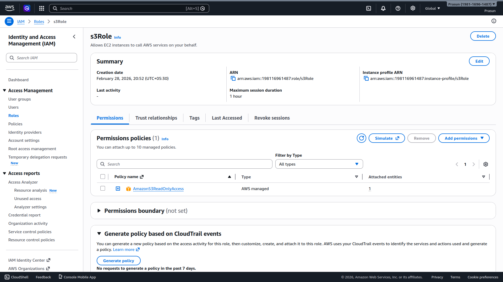
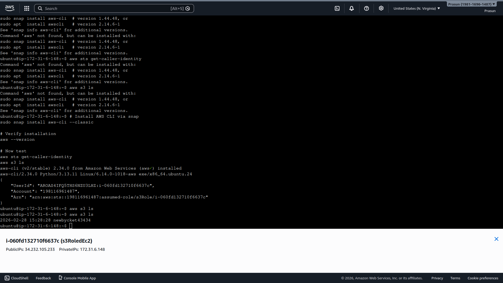

# Access S3 from EC2 using IAM Role

## Project Structure
```
.
├── README.md
└── Screenshots
    ├── 01_IAM_Role_Created.png
    └── 02_S3_Access_Terminal.png
```

## What Was Done
1. Created IAM Role `s3Role` — trusted entity: EC2, policy: `AmazonS3ReadOnlyAccess`
2. Attached `s3Role` to EC2 instance `s3RoledEc2` via Actions → Security → Modify IAM role
3. Installed AWS CLI on EC2: `sudo snap install aws-cli --classic`
4. Ran `aws sts get-caller-identity` → confirmed `assumed-role/s3Role/i-060fd132710f6637c` ✅
5. Ran `aws s3 ls` → listed bucket `newbycket43434` with no access keys or `aws configure` ✅
6. Demonstrates IAM best practice: role-based access, zero hardcoded credentials

## Screenshots
### 01 — IAM Role Created
*Shows `s3Role` with `AmazonS3ReadOnlyAccess` attached, trusted entity EC2.*


### 02 — S3 Access from Terminal
*Shows `assumed-role/s3Role` in ARN and `aws s3 ls` listing the bucket.*

